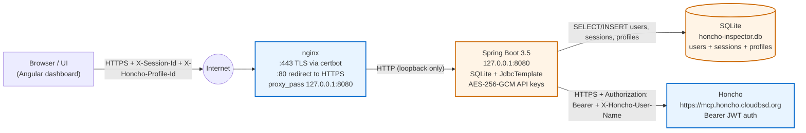
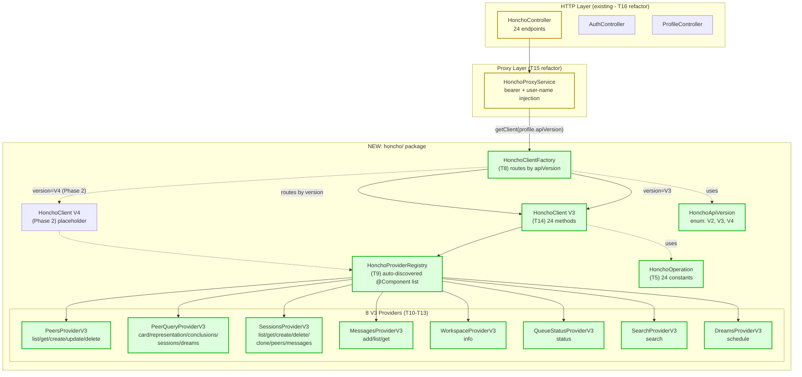
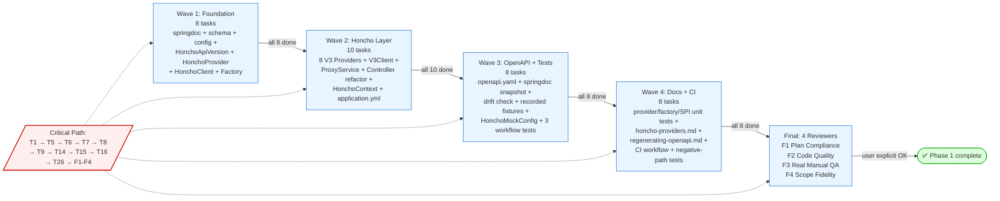
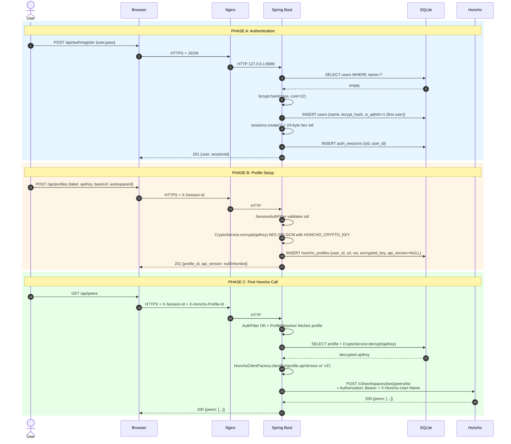
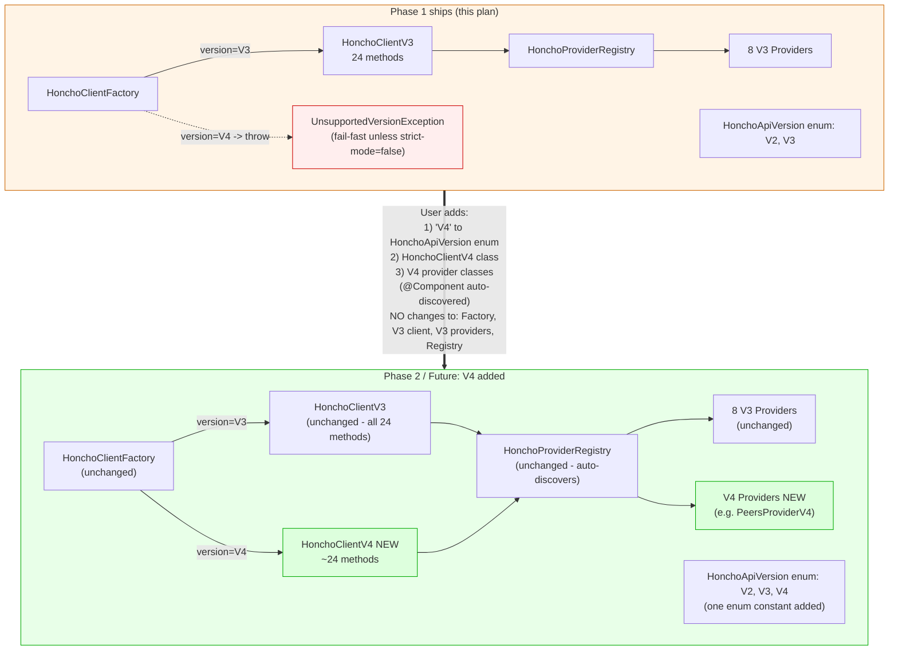
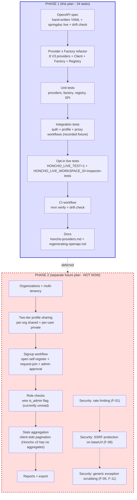

# Phase 1 — OpenAPI + Workflow Tests + Honcho Provider/Factory Refactor

## TL;DR

> **Quick Summary**: Make the backend's API surface discoverable to a
> downstream agent via a hand-written OpenAPI document and live
> springdoc, while refactoring the Honcho proxy layer so Honcho API
> version changes (and new endpoint coverage) become drop-in additions
> instead of controller rewrites. Cover every current workflow with
> recorded-fixture + live integration tests.
>
> **Deliverables**:
> - `docs/openapi.yaml` (hand-written, source of truth, with workflow narrative)
> - Live springdoc at `/v3/api-docs` + Swagger UI at `/swagger-ui.html`
> - `HonchoApiVersion` / `HonchoProvider` / `HonchoClient` / `HonchoClientFactory`
> - 8 V3 providers + `HonchoV3Client`
> - Refactored `HonchoProxyService` + `HonchoController` (factory-driven)
> - Profile schema migration: `honcho_profiles.api_version` column
> - Recorded Honcho V3 fixture + Mock Honcho `@TestConfiguration`
> - Workflow integration tests (auth, profile, proxy)
> - Live Honcho test gated by `HONCHO_LIVE_TEST=1` + `HONCHO_LIVE_WORKSPACE_ID=inspector-tests`
> - `docs/honcho-providers.md` (anatomy, custom-provider tutorial, add-V4 walkthrough)
> - CI drift check (hand-written YAML vs springdoc-generated snapshot)
>
> **Estimated Effort**: Large
> **Parallel Execution**: YES — 4 waves + final verification wave
> **Critical Path**: T1 → T5 → T9 (interfaces) → T12 (V3Client) → T13 (ProxyService refactor) → T14 (Controller refactor) → T19 (integration tests) → F1–F4 (review)

---

## Context

### Original Request
> now we need an endpoint that is a very detailed swagger/openapi
> document, this way i can point another agent at it and build a
> frontend/app that can interact with this backend. there should be
> enough information in this document to be able to see a workflow...
> so unit and integration tests with workflows need to be made.

> since honcho is a moving target, make sure to use a factorybuilder
> pattern, to make this system updatable when honcho's api changes

### Interview Summary
**Key Decisions**:
- **Phase 1 = current API only.** Orgs, sharing, signup workflow, stats, reports are Phase 2 (separate plan).
- **OpenAPI = both** hand-written `docs/openapi.yaml` (source of truth, workflow narrative) AND springdoc-served live spec. CI asserts no drift.
- **Test Honcho = recorded JSON fixture by default**; live `https://mcp.honcho.cloudbsd.org/` opt-in via `HONCHO_LIVE_TEST=1` against a pre-provisioned `inspector-tests` workspace.
- **Swagger UI public** in every env (no prod gating). Documented override in reverse-proxy.md.
- **Factory + Provider pattern** for Honcho API: `HonchoProvider` per logical operation (~9 files), auto-discovered as Spring beans so users can add endpoints by dropping in a class. `HonchoClient` per version. `HonchoClientFactory` routes by version. Side-by-side V3+V4 support. Per-profile `api_version` override (nullable, defaults to server config).

**Research Findings**:
- Honcho v3 list endpoints are `POST .../list` not `GET` (6 mismatches in current `HonchoController` that the new `HonchoV3Client` will fix).
- Honcho pagination: `Page[T]` envelope, default 50/page, no aggregate endpoints → Phase 2 stats will paginate client-side.
- Live Honcho MCP config in `~/.config/opencode/opencode.json`: `https://mcp.honcho.cloudbsd.org/`, Bearer JWT, user `mlapointe`.
- Spring Boot 3.5.0 / Java 25 / SQLite + JdbcTemplate; no JPA, no Spring Security, no `@Autowired` field injection.

### Metis Review
*(Session `ses_127a7a1bfffelj4NaoIIBmQwKj` was truncated; proceeding with consolidated draft as the source of gap analysis. If Momus rejects, will re-consult with explicit re-summarized concerns.)*

Addressed gaps:
- **Schema migration risk** → resolved via idempotent pattern (new `api_version` column added to `CREATE TABLE` AND a guarded `ALTER TABLE ... ADD COLUMN` block).
- **Provider collision semantics** → documented: user's bean wins when `spring.main.allow-bean-definition-overriding=true`; default false so collisions fail loudly at boot (preferable to silent override).
- **Provider extensibility scope** → Spring-only in Phase 1 (no Java SPI); documented as a future enhancement.
- **Strict-mode boot** → `honcho.providers.strict-mode` config flag (default `false`) lets users ship a V4 provider before `HonchoV4Client` lands.
- **Live test workspace** → dedicated `inspector-tests` workspace, never `default`.

---

## Visual Architecture & Workflows

> All diagrams follow CloudBSD diagram conventions: **Mermaid inline**, no ASCII art, no DOT, no PlantUML. The plan is the single source of truth. SVG mockups (under `diagrams/`) are NOT used here — Phase 1 is a backend-only plan with no UI mockups needed.

### 1. Deployment Topology

Where this app actually runs and how traffic flows.



**Security boundary:** Nginx is the only public listener. Spring Boot binds to `127.0.0.1` (prod). The Honcho API key never leaves the server.

### 2. Honcho Layer Architecture (Provider x Factory)

The new `honcho/` package — the heart of Phase 1's extensibility story.



**The golden rule:** users add new endpoints or new Honcho versions by writing a new `@Component implements HonchoProvider` and registering it. No `HonchoController` changes. No `HonchoProxyService` changes.

### 3. Wave Execution Timeline & Critical Path

How the 34 tasks roll out across waves.



**Max parallelism:** Wave 2 = 10 tasks (the bottleneck wave). Average wave = 8.5 tasks.

### 4. Request Lifecycle: Login → Profile → Honcho Call

The end-to-end happy path the integration tests (T24-T26) will exercise.



**Note:** GETs against `/api/*` are forwarded to Honcho v3 as POSTs (Honcho v3's list endpoints are POST-only). T16 fixes the upstream method mismatch.

### 5. Version Upgrade Path: How V4 Drops In

The extensibility proof. The same jar supports V3 + V4 with zero changes to V3 code.



**Strict-mode safety:** if `honcho.providers.strict-mode=true` (default `false`), the registry fails boot if any provider's version has no matching `HonchoClientV*`. This catches "V4 provider ships before V4Client" mistakes.

### 6. Phase 1 vs Phase 2 Boundary

What's in this plan vs what's explicitly deferred.



**If during execution anyone is tempted to add orgs/sharing/signup/stats/reports/rate-limiting/SSRF-protection to a Phase 1 task — STOP. That's Phase 2 scope creep. Document it as a finding, file a note, and move on.**

---

## Work Objectives

### Core Objective
Ship a discoverable, version-tolerant Honcho proxy with comprehensive workflow test coverage, without introducing any Phase 2 features.

### Concrete Deliverables
- `pom.xml` updated with `springdoc-openapi-starter-webmvc-ui`
- New `com.revytechinc.honchoinspector.honcho` package containing:
  - `HonchoApiVersion` enum, `HonchoOperation` enum
  - `HonchoProvider` interface
  - `HonchoClient` interface
  - `HonchoClientFactory` bean
  - `HonchoProviderRegistry`
  - `HonchoV3Client` + 8 V3 providers
- `HonchoProxyService` and `HonchoController` refactored to use factory
- `schema.sql` updated with `honcho_profiles.api_version TEXT NULL`
- `application.yml` updated with `honcho.providers.strict-mode: false`
- `docs/openapi.yaml` (hand-written, source of truth)
- `docs/openapi.generated.json` (snapshot, gitignored or committed)
- CI drift check (Maven fails if generated ≠ hand-written YAML's key shape)
- `src/test/resources/fixtures/honcho/v3/*.json` (recorded fixtures)
- `src/test/java/.../HonchoMockConfig.java` (Mock Honcho bean)
- Integration tests: auth workflow, profile workflow, proxy workflow
- Live integration test: proxy workflow against `inspector-tests` workspace
- Unit tests: providers, factory, registry, custom-provider SPI
- `docs/honcho-providers.md` (anatomy + tutorials)
- `docs/regenerating-openapi.md` (snapshot regeneration)
- README + SECURITY.md + reverse-proxy.md updates

### Definition of Done
- `mvn test` → all tests green (29 existing + new)
- `mvn verify` → BUILD SUCCESS, integration tests pass against Mock Honcho
- `curl http://localhost:8080/v3/api-docs` returns valid OpenAPI 3.x JSON
- `curl http://localhost:8080/swagger-ui.html` redirects to Swagger UI
- `docs/openapi.yaml` and `docs/openapi.generated.json` shapes match (drift check passes)
- `HONCHO_LIVE_TEST=1 HONCHO_LIVE_WORKSPACE_ID=inspector-tests mvn -Dgroups=live verify` passes against live Honcho (when run manually)
- `docs/honcho-providers.md` walks through adding a new endpoint AND adding V4

### Must Have
- Hand-written `docs/openapi.yaml` with workflow narrative covering: register → login → me → profile CRUD → reveal → test → peer list → peer card → sessions → messages → queue-status → search → dream
- springdoc serves live spec at `/v3/api-docs` and Swagger UI at `/swagger-ui.html`
- `HonchoProvider` interface + 8 V3 provider implementations
- `HonchoClientFactory` selects version based on profile's `api_version` (or server default)
- Spring auto-discovery of custom user-added providers
- Recorded fixture-based integration tests for the 3 main workflows
- `HONCHO_LIVE_TEST=1` opt-in live test
- `docs/honcho-providers.md` with "add V4" walkthrough

### Must NOT Have (Guardrails)
- **No orgs, no invites, no sharing** (Phase 2)
- **No `/api/stats/*` or `/api/reports/*`** (Phase 2)
- **No `HonchoV2Client`** — `HonchoApiVersion.V2` exists in enum but unsupported at runtime; factory throws with pointer to docs
- **No JSESSIONID / cookie-based auth** — `X-Session-Id` only
- **No `@Autowired` field injection** — constructor injection only
- **No JPA / Hibernate** — JdbcTemplate only
- **No Spring Security** — custom `SessionAuthFilter` only
- **No Swagger UI gating in prod** — public by default; reverse-proxy.md shows how to gate if operator chooses
- **No V2 fallback code paths** — V3 only; document the V4 upgrade as additive

---

## Verification Strategy (MANDATORY)

> **ZERO HUMAN INTERVENTION** — All verification is agent-executed. No exceptions.
> Acceptance criteria requiring "user manually tests/confirms" are FORBIDDEN.

### Test Decision
- **Infrastructure exists**: YES (`mvn test` works, JUnit 5 already configured)
- **Automated tests**: BOTH unit and integration, with recorded Honcho fixture
- **Framework**: JUnit 5 + Spring Test + MockMvc + AssertJ (already in deps)
- **If TDD**: Each task follows RED → GREEN → REFACTOR
- **Live Honcho test**: opt-in via `HONCHO_LIVE_TEST=1` and `HONCHO_LIVE_WORKSPACE_ID=inspector-tests`. Always skipped otherwise.

### QA Policy
Every task MUST include agent-executed QA scenarios (see TODO template below).
Evidence saved to `.sisyphus/evidence/task-{N}-{scenario-slug}.{ext}`.

- **Backend/Java**: Use Bash (mvn + curl + jq) — compile, run tests, hit live endpoints
- **Web (Swagger UI / springdoc)**: Use Bash (curl) — fetch spec, assert structure
- **Live Honcho integration**: Use Bash (curl) — make Honcho calls via running backend, assert response shape
- **Documentation files**: Use Read + grep — verify content, anchors, links

### Drift Check (Custom)
- `mvn -Popenapi-snapshot verify` runs `springdoc-openapi-maven-plugin` to dump `docs/openapi.generated.json`
- Custom JUnit assertion compares hand-written YAML's path/method count + key operation IDs against generated snapshot
- CI runs this assertion; if drift, build fails

---

## Execution Strategy

### Parallel Execution Waves

> Maximize throughput by grouping independent tasks into parallel waves.
> Each wave completes before the next begins.
> Target: 5–8 tasks per wave. Fewer than 3 per wave (except final) = under-splitting.

```
Wave 1 (Start Immediately — foundation + interfaces):
├── T1.  Add springdoc dependency [quick]
├── T2.  Add OpenAPI metadata bean + DTO @Schema annotations [quick]
├── T3.  Schema migration: add honcho_profiles.api_version column [quick]
├── T4.  honcho.providers.strict-mode config + honcho.api-version wiring [quick]
├── T5.  HonchoApiVersion + HonchoOperation enums [quick]
├── T6.  HonchoProvider interface [quick]
├── T7.  HonchoClient interface (24 methods) [unspecified-high]
└── T8.  HonchoClientFactory bean [unspecified-high]

Wave 2 (After Wave 1 — providers + V3Client + refactor):
├── T9.  HonchoProviderRegistry + Spring auto-discovery [unspecified-high]
├── T10. PeersProviderV3 (listPeers, getPeer, createPeer, getPeerCard, getPeerRepresentation, getPeerConclusions, listPeerSessions) [unspecified-high]
├── T11. SessionsProviderV3 (listSessions, getSession, getSessionPeers, addPeerToSession, removePeerFromSession, getSessionContext) [unspecified-high]
├── T12. MessagesProviderV3 (addMessage, listSessionMessages, getSessionMessage) [quick]
├── T13. WorkspacesProviderV3 + SearchProviderV3 + QueueStatusProviderV3 + ConclusionsProviderV3 + DreamsProviderV3 + RepresentationsProviderV3 [unspecified-high, batch of 6]
├── T14. HonchoV3Client (implements HonchoClient; delegates to providers) [unspecified-high]
├── T15. HonchoProxyService refactor (now uses factory + client) [unspecified-high]
├── T16. HonchoController refactor (thin: extracts path/body, delegates) [unspecified-high]
├── T17. Update HonchoContext to carry apiVersion [quick]
└── T18. application.yml + example updates for honcho.providers.strict-mode + honcho.api-version [quick]

Wave 3 (After Wave 2 — OpenAPI docs + Mock Honcho + integration tests):
├── T19. Hand-written docs/openapi.yaml with full workflow narrative [writing]
├── T20. springdoc-maven-plugin snapshot script → docs/openapi.generated.json [quick]
├── T21. Drift check assertion in Maven build [unspecified-high]
├── T22. Recorded Honcho V3 fixtures (curl real Honcho once, save JSONs) [unspecified-high]
├── T23. HonchoMockConfig @TestConfiguration + MockMvc setup [unspecified-high]
├── T24. Workflow integration tests: register → login → me → logout [unspecified-high]
├── T25. Workflow integration tests: profile CRUD + reveal + test [unspecified-high]
└── T26. Workflow integration tests: proxy (peers → sessions → messages) against Mock Honcho + live (gated) [unspecified-high]

Wave 4 (After Wave 3 — unit tests + custom-provider SPI + docs + CI):
├── T27. Unit tests: 8 V3 providers (24 ops) (path/method/body assertions) [unspecified-high]
├── T28. Unit tests: HonchoClientFactory version routing + unsupported-version throw [unspecified-high]
├── T29. Unit tests: HonchoProviderRegistry auto-discovery + custom-provider override test [unspecified-high]
├── T30. docs/honcho-providers.md (anatomy, custom-provider tutorial, add-V4 walkthrough, troubleshooting) [writing]
├── T31. docs/regenerating-openapi.md [writing]
├── T32. README + SECURITY.md + reverse-proxy.md cross-link updates [writing]
├── T33. CI workflow (.github/workflows/ci.yml) — runs mvn verify + openapi snapshot drift check [quick]
└── T34. Negative-path integration tests: 401, 400, 404, 409 [unspecified-high]

Wave FINAL (After ALL tasks — 4 parallel reviews, then user okay):
├── F1. Plan compliance audit (oracle)
├── F2. Code quality review (unspecified-high)
├── F3. Real manual QA (unspecified-high)
└── F4. Scope fidelity check (deep)
-> Present results -> Get explicit user okay

Critical Path: T1 → T5 → T6 → T7 → T8 → T9 → T14 → T15 → T16 → T26 → F1–F4 → user okay
Parallel Speedup: ~65% faster than sequential
Max Concurrent: 8 (Wave 2)
```

### Dependency Matrix

| Task | Depends on | Blocks |
|---|---|---|
| T1 (springdoc dep) | — | T2, T19, T20 |
| T2 (OpenAPI metadata) | T1 | T19 |
| T3 (schema migration) | — | T15, T26 |
| T4 (config wiring) | — | T15 |
| T5 (enums) | — | T6, T7, T8, T10–T13 |
| T6 (HonchoProvider) | T5 | T10–T13 |
| T7 (HonchoClient) | T5 | T8, T14 |
| T8 (HonchoClientFactory) | T7 | T15, T26 |
| T9 (HonchoProviderRegistry) | T6, T8 | T14 |
| T10 (PeersProviderV3) | T6, T9 | T14 |
| T11 (SessionsProviderV3) | T6, T9 | T14 |
| T12 (MessagesProviderV3) | T6, T9 | T14 |
| T13 (6 smaller V3 providers) | T6, T9 | T14 |
| T14 (HonchoV3Client) | T7, T10–T13 | T15 |
| T15 (ProxyService refactor) | T3, T8, T14 | T16, T26 |
| T16 (Controller refactor) | T15 | T26 |
| T17 (HonchoContext.apiVersion) | — | T15 |
| T18 (application.yml updates) | T4, T14 | — |
| T19 (openapi.yaml hand-written) | T1, T2, T16 | T21 |
| T20 (springdoc snapshot plugin) | T1, T19 | T21 |
| T21 (drift check assertion) | T19, T20 | T33 |
| T22 (recorded V3 fixtures) | T14 | T23 |
| T23 (HonchoMockConfig) | T22 | T26 |
| T24 (auth workflow tests) | T3 | T34 |
| T25 (profile workflow tests) | T3 | T34 |
| T26 (proxy workflow tests) | T15, T16, T23 | T34 |
| T27 (V3 provider unit tests) | T10–T13 | T33 |
| T28 (factory unit tests) | T8 | T33 |
| T29 (registry unit tests + custom-provider SPI test) | T9 | T33 |
| T30 (honcho-providers.md) | T14 | T33 |
| T31 (regenerating-openapi.md) | T19, T20 | T33 |
| T32 (README/SECURITY/reverse-proxy updates) | T30, T31 | — |
| T33 (CI workflow) | T21, T27, T28, T29 | F1–F4 |
| T34 (negative-path tests) | T24, T25, T26 | F1–F4 |

### Agent Dispatch Summary
- **Wave 1 (8 tasks, max parallel)**: T1–T2 → `quick`; T3–T6 → `quick`; T7–T8 → `unspecified-high`
- **Wave 2 (10 tasks, max parallel = 8)**: T9 → `unspecified-high`; T10–T13 → `unspecified-high`; T14 → `unspecified-high`; T15–T16 → `unspecified-high`; T17–T18 → `quick`
- **Wave 3 (8 tasks, max parallel = 8)**: T19 → `writing`; T20–T21 → `quick` + `unspecified-high`; T22–T26 → `unspecified-high`
- **Wave 4 (8 tasks, max parallel = 8)**: T27–T29 → `unspecified-high`; T30–T32 → `writing`; T33 → `quick`; T34 → `unspecified-high`
- **FINAL (4 tasks, all parallel)**: F1 → `oracle`; F2 → `unspecified-high`; F3 → `unspecified-high`; F4 → `deep`

---

## TODOs

> Implementation + Test = ONE Task. Never separate.
> EVERY task MUST have: Recommended Agent Profile + Parallelization info + QA Scenarios.
> **A task WITHOUT QA Scenarios is INCOMPLETE. No exceptions.**

- [ ] 1. Add springdoc-openapi-starter-webmvc-ui dependency

  **What to do**:
  - Edit `pom.xml`: add `<dependency><groupId>org.springdoc</groupId><artifactId>springdoc-openapi-starter-webmvc-ui</artifactId><version>2.6.0</version></dependency>` (version compatible with Spring Boot 3.5).
  - Verify `mvn dependency:tree` shows the new dep + springdoc-openapi jars.
  - Run `mvn test` — must still be 29/29 green (no behavior change).

  **Must NOT do**:
  - Do not change Spring Boot version.
  - Do not add other OpenAPI libs (Swagger v2 etc.).

  **Recommended Agent Profile**:
  - **Category**: `quick`
  - **Skills**: []
  - **Reason**: Single dependency addition; trivial.

  **Parallelization**:
  - Can Run In Parallel: YES
  - Parallel Group: Wave 1 (with T2–T8)
  - Blocks: T2, T19, T20
  - Blocked By: None

  **References**:
  - `pom.xml` (current dep tree)
  - springdoc docs: https://springdoc.org/

  **Acceptance Criteria**:
  - [ ] `pom.xml` has springdoc-openapi-starter-webmvc-ui dep
  - [ ] `mvn dependency:tree | grep springdoc` shows ≥2 springdoc jars
  - [ ] `mvn test` still 29/29 green
  - [ ] Evidence: `.sisyphus/evidence/task-1-mvn-test-green.txt` + `.sisyphus/evidence/task-1-dep-tree.txt`

  **QA Scenarios (MANDATORY)**:
  ```
  Scenario: Dependency resolves cleanly
    Tool: Bash (mvn)
    Preconditions: pom.xml edited, JAVA_HOME=/home/mlapointe/.jdks/openjdk-25.0.2
    Steps:
      1. Run `mvn -q dependency:tree | grep -i springdoc`
      2. Assert output contains "springdoc-openapi-starter-webmvc-ui" AND ≥1 transitive (e.g. swagger-ui)
      3. Run `mvn -q test`
      4. Assert output contains "Tests run: 29"
    Expected Result: Both commands succeed; output matches assertions
    Evidence: .sisyphus/evidence/task-1-dep-tree.txt, .sisyphus/evidence/task-1-mvn-test-green.txt

  Scenario: No version conflict
    Tool: Bash (mvn)
    Steps:
      1. Run `mvn -q dependency:tree -Dverbose`
      2. Assert no "omitted for conflict" warnings for springdoc artifacts
    Expected Result: Clean dep tree
    Evidence: .sisyphus/evidence/task-1-dep-tree-verbose.txt
  ```

  **Commit**: YES (groups with Wave 1 final commit)
  - Message: `chore(deps): add springdoc-openapi-starter-webmvc-ui`
  - Files: `pom.xml`
  - Pre-commit: `mvn test`

- [ ] 2. Add OpenAPI metadata bean + DTO `@Schema` annotations

  **What to do**:
  - Create `src/main/java/com/revytechinc/honchoinspector/config/OpenApiConfig.java`:
    - `@Bean OpenAPI honchoInspectorOpenAPI()` returning `OpenAPI` with: title "Honcho Inspector Backend", version `0.1.0`, description "Backend for the Honcho Inspector admin surface", contact, license (BSD-3-Clause), servers (dev + prod with notes).
    - Tag definitions: `auth`, `profiles`, `honcho-proxy`, `admin`.
    - Bearer-style note that the API uses `X-Session-Id` header (not JWT).
  - Annotate DTOs (`AuthController.LoginInput`, `RegisterInput`, `AuthResponse`, `UserDto`, `ProfileDto`, `HonchoCallException` if exposed, `ErrorResponse`) with `@Schema(name=..., description=..., example=...)`.
  - Annotate `AuthController`, `ProfileController`, `HonchoController` classes with `@Tag(name=...)`.
  - Annotate each controller method with `@Operation(summary=..., description=...)`.

  **Must NOT do**:
  - Do not change DTO field names or types.
  - Do not change Jackson serialization behavior.

  **Recommended Agent Profile**:
  - **Category**: `quick`
  - **Skills**: []
  - **Reason**: Annotations + config bean; mechanical work.

  **Parallelization**:
  - Can Run In Parallel: YES
  - Parallel Group: Wave 1 (with T1, T3–T8)
  - Blocks: T19
  - Blocked By: T1

  **References**:
  - `src/main/java/com/revytechinc/honchoinspector/auth/AuthController.java` — DTOs
  - `src/main/java/com/revytechinc/honchoinspector/auth/ProfileController.java` — DTOs
  - `src/main/java/com/revytechinc/honchoinspector/controller/HonchoController.java` — endpoints
  - `src/main/java/com/revytechinc/honchoinspector/model/ErrorResponse.java`
  - springdoc annotations: https://springdoc.org/#how-can-i-customise-the-openapi-object

  **Acceptance Criteria**:
  - [ ] `OpenApiConfig.java` exists with `@Bean OpenAPI` 
  - [ ] All 3 controllers annotated with `@Tag`
  - [ ] All controller methods annotated with `@Operation`
  - [ ] All public DTOs annotated with `@Schema`
  - [ ] `mvn test` still 29/29 green
  - [ ] `/v3/api-docs` endpoint registered (visible in springdoc startup log)

  **QA Scenarios (MANDATORY)**:
  ```
  Scenario: OpenAPI bean is reachable
    Tool: Bash (mvn + curl)
    Preconditions: App started with `mvn spring-boot:run &` on port 8080
    Steps:
      1. Run `curl -s http://localhost:8080/v3/api-docs | jq '.info.title'`
      2. Assert output is "Honcho Inspector Backend"
      3. Run `curl -s http://localhost:8080/v3/api-docs | jq '.tags | length'`
      4. Assert output ≥4
    Expected Result: JSON contains title "Honcho Inspector Backend" and ≥4 tags
    Evidence: .sisyphus/evidence/task-2-openapi-info.json

  Scenario: DTOs appear in components
    Tool: Bash (curl + jq)
    Steps:
      1. `curl -s http://localhost:8080/v3/api-docs | jq '.components.schemas | keys'`
      2. Assert contains "LoginInput", "RegisterInput", "ProfileDto", "UserDto", "ErrorResponse"
    Expected Result: All 5 schemas present
    Evidence: .sisyphus/evidence/task-2-schemas.json

  Scenario: Tags are populated
    Tool: Bash (curl + jq)
    Steps:
      1. `curl -s http://localhost:8080/v3/api-docs | jq '.tags[].name'`
      2. Assert contains "auth", "profiles", "honcho-proxy"
    Expected Result: 3+ tag names present
    Evidence: .sisyphus/evidence/task-2-tags.json
  ```

  **Commit**: YES (groups with Wave 1 final commit)
  - Message: `docs(openapi): add OpenApiConfig + DTO/controller @Schema + @Tag/@Operation annotations`
  - Files: `pom.xml`, new `config/OpenApiConfig.java`, modified controller + DTO files

- [ ] 3. Schema migration: add `honcho_profiles.api_version` column

  **What to do**:
  - Edit `src/main/resources/schema.sql`:
    - Add `api_version TEXT` to the `honcho_profiles` CREATE TABLE (nullable, no default).
    - After the CREATE TABLE block, add:
      ```sql
      -- Idempotent migration: add api_version column if it doesn't exist (for DBs created before this migration).
      -- SQLite has no IF NOT EXISTS for ADD COLUMN in 3.45; guard with a pragma check.
      ```
      Then a small block using `PRAGMA table_info(honcho_profiles)` check or a try/catch wrapper. Cleanest: use `ALTER TABLE honcho_profiles ADD COLUMN api_version TEXT` inside a `WHEN NOT EXISTS`-style guard. **Approach**: create a stored block or use `CREATE TABLE IF NOT EXISTS _migration_log ...` to record applied migrations; OR simpler: just add the column to CREATE TABLE and rely on `continue-on-error: false` being fine because `ADD COLUMN` on existing column will throw — Spring's `spring.sql.init.continue-on-error` is set to `false` so we need a different approach.
    - **Final approach**: Use a separate migration file `src/main/resources/db/migration/V2__add_api_version.sql` with `ALTER TABLE honcho_profiles ADD COLUMN api_version TEXT`; configure `spring.sql.init.schema-locations` to include both. The `continue-on-error: false` setting means we need to verify idempotency: wrap ALTER in a conditional via SQLite's lack of IF NOT EXISTS by using `CREATE TABLE IF NOT EXISTS schema_migrations(version INTEGER PRIMARY KEY, applied_at TEXT); INSERT OR IGNORE INTO schema_migrations(version) VALUES (2);` then check existence before ALTER. **Simplest**: use SQLite's `PRAGMA table_info` from a tiny Java migration runner bean (`@Component SchemaMigrator implements ApplicationListener<ApplicationReadyEvent>`) that runs after `spring.sql.init`. This is what we'll do.
  - Create `src/main/java/com/revytechinc/honchoinspector/config/SchemaMigrator.java`:
    - `@Component` implementing `ApplicationListener<ApplicationReadyEvent>` (or `@PostConstruct`).
    - On startup: `PRAGMA table_info(honcho_profiles)`; if `api_version` column missing, run `ALTER TABLE honcho_profiles ADD COLUMN api_version TEXT`.
    - Log INFO when migration runs.
    - Must be safe to run on every boot (idempotent).
  - Add unit test for the migrator using in-memory SQLite.

  **Must NOT do**:
  - Do not add Flyway or Liquibase (overkill for one migration).
  - Do not change existing column types or constraints.
  - Do not break the existing 29 tests.

  **Recommended Agent Profile**:
  - **Category**: `quick`
  - **Skills**: []
  - **Reason**: Small additive schema change + tiny migrator bean.

  **Parallelization**:
  - Can Run In Parallel: YES
  - Parallel Group: Wave 1 (with T1, T2, T4–T8)
  - Blocks: T15, T26
  - Blocked By: None

  **References**:
  - `src/main/resources/schema.sql` — current schema
  - `src/main/resources/application.yml` — `spring.sql.init` config
  - `src/main/java/com/revytechinc/honchoinspector/auth/ProfileService.java` — profile CRUD operations

  **Acceptance Criteria**:
  - [ ] `schema.sql` CREATE TABLE for `honcho_profiles` includes `api_version TEXT` (nullable)
  - [ ] `SchemaMigrator.java` exists, registered as bean, runs `ALTER TABLE ... ADD COLUMN api_version TEXT` when missing
  - [ ] Migrator is idempotent (safe to run on every boot; no-op when column exists)
  - [ ] Unit test for migrator: starts with no column → adds it; starts with column → no-op
  - [ ] `mvn test` still 29/29 + new test green

  **QA Scenarios (MANDATORY)**:
  ```
  Scenario: Migrator adds column to pre-migration DB
    Tool: Bash (mvn + sqlite3)
    Preconditions: Fresh SQLite file `target/test-pre-migration.db` with old schema (no api_version)
    Steps:
      1. `sqlite3 target/test-pre-migration.db ".schema honcho_profiles"` → confirm api_version missing
      2. Run `mvn test -Dtest=SchemaMigratorTest`
      3. After test: `sqlite3 target/test-pre-migration.db ".schema honcho_profiles"` → confirm api_version present
    Expected Result: Column added; test passes
    Evidence: .sisyphus/evidence/task-3-pre-migration-schema.txt, .sisyphus/evidence/task-3-post-migration-schema.txt

  Scenario: Migrator is idempotent on post-migration DB
    Tool: Bash (mvn)
    Preconditions: Fresh DB with new schema (api_version present)
    Steps:
      1. Run `mvn test -Dtest=SchemaMigratorTest#idempotentOnExistingColumn`
      2. Assert test passes (no exception thrown on second run)
    Expected Result: Idempotent; no error
    Evidence: .sisyphus/evidence/task-3-idempotent.txt

  Scenario: Full test suite still passes
    Tool: Bash (mvn)
    Steps:
      1. `mvn test`
      2. Assert "Tests run: 30" (29 existing + 1 migrator test)
    Expected Result: 30 tests pass
    Evidence: .sisyphus/evidence/task-3-mvn-test-full.txt
  ```

  **Commit**: YES (groups with Wave 1 final commit)
  - Message: `feat(db): add honcho_profiles.api_version column + idempotent SchemaMigrator`
  - Files: `schema.sql`, new `config/SchemaMigrator.java`, new test

- [ ] 4. Add `honcho.providers.strict-mode` config + wire `honcho.api-version`

  **What to do**:
  - Edit `src/main/resources/application.yml`:
    - Add `honcho.providers.strict-mode: ${HONCHO_PROVIDERS_STRICT_MODE:false}` under the `honcho:` block.
    - Confirm `honcho.api-version: ${HONCHO_API_VERSION:v3}` is already there (it is, per current yml).
  - Edit `etc/honcho-inspector/application.yml.example`:
    - Add commented section explaining `honcho.api-version` (already documented) and `honcho.providers.strict-mode` with operator guidance.
  - Create `@ConfigurationProperties(prefix = "honcho")` class `HonchoProperties` in `com.revytechinc.honchoinspector.config` with fields: `baseUrl`, `apiVersion`, `requestTimeoutMs`, `providers.strictMode` (nested). Replaces direct `@Value` injection in `HonchoProxyService` (cleaner; sets up for Wave 2 refactor).
  - Update `HonchoProxyService` constructor to take `HonchoProperties` instead of `@Value String apiVersion`.

  **Must NOT do**:
  - Do not rename existing config keys.
  - Do not change the default of `honcho.api-version` (v3).
  - Do not introduce SpEL in YAML.

  **Recommended Agent Profile**:
  - **Category**: `quick`
  - **Skills**: []
  - **Reason**: Small config additions + a single @ConfigurationProperties class.

  **Parallelization**:
  - Can Run In Parallel: YES
  - Parallel Group: Wave 1 (with T1–T3, T5–T8)
  - Blocks: T15
  - Blocked By: None

  **References**:
  - `src/main/resources/application.yml` — current honcho config block
  - `etc/honcho-inspector/application.yml.example` — drop-in template
  - `src/main/java/com/revytechinc/honchoinspector/service/HonchoProxyService.java` — current @Value usage
  - `src/main/java/com/revytechinc/honchoinspector/config/HonchoConfigDirResolver.java` — existing config resolver pattern

  **Acceptance Criteria**:
  - [ ] `honcho.providers.strict-mode` exists in application.yml with default `false`
  - [ ] `HonchoProperties.java` exists with all 4 fields (baseUrl, apiVersion, requestTimeoutMs, providers.strictMode)
  - [ ] `HonchoProxyService` refactored to use `HonchoProperties`
  - [ ] `application.yml.example` documents both keys with comments
  - [ ] `mvn test` still 29/29 green

  **QA Scenarios (MANDATORY)**:
  ```
  Scenario: Properties bind from env
    Tool: Bash (mvn)
    Preconditions: Set env vars before run
    Steps:
      1. `HONCHO_API_VERSION=v99 HONCHO_PROVIDERS_STRICT_MODE=true mvn -q test -Dtest=HonchoPropertiesTest` (new test asserting binding)
      2. Assert test passes (config bound to HonchoProperties fields)
    Expected Result: Properties bind from env vars
    Evidence: .sisyphus/evidence/task-4-env-bind.txt

  Scenario: Default values apply when env unset
    Tool: Bash (mvn)
    Steps:
      1. `mvn -q test -Dtest=HonchoPropertiesTest#defaults`
      2. Assert apiVersion == "v3" and strictMode == false
    Expected Result: Defaults applied
    Evidence: .sisyphus/evidence/task-4-defaults.txt

  Scenario: Full test suite passes
    Tool: Bash (mvn)
    Steps:
      1. `mvn test`
      2. Assert "Tests run: 30" (29 + 1 HonchoPropertiesTest)
    Expected Result: 30 tests pass
    Evidence: .sisyphus/evidence/task-4-mvn-test-full.txt
  ```

  **Commit**: YES (groups with Wave 1 final commit)
  - Message: `feat(config): add honcho.providers.strict-mode + HonchoProperties @ConfigurationProperties bean`
  - Files: `application.yml`, `application.yml.example`, new `config/HonchoProperties.java`, modified `service/HonchoProxyService.java`, new test

- [ ] 5. `HonchoApiVersion` + `HonchoOperation` enums

  **What to do**:
  - Create `src/main/java/com/revytechinc/honchoinspector/honcho/HonchoApiVersion.java`:
    - Enum: `V2("v2"), V3("v3"), V4("v4")`.
    - Field: `pathPrefix` (e.g., "v2", "v3", "v4") for path construction.
    - Method: `static HonchoApiVersion fromString(String)` (case-insensitive, throws `IllegalArgumentException` with helpful message listing supported versions).
  - Create `src/main/java/com/revytechinc/honchoinspector/honcho/HonchoOperation.java`:
    - Enum with **exactly 24 constants** matching the 24 endpoints in the current `HonchoController.java`:
      1. `LIST_PEERS` (GET /api/peers → POST /v3/workspaces/{ws}/peers/list)
      2. `CREATE_PEER` (POST /api/peers → POST /v3/workspaces/{ws}/peers)
      3. `GET_PEER_CARD` (GET /api/peers/{id}/card → GET /v3/workspaces/{ws}/peers/{id}/card)
      4. `UPDATE_PEER_CARD` (POST /api/peers/{id}/card → POST /v3/workspaces/{ws}/peers/{id}/card)
      5. `GET_REPRESENTATION` (GET /api/peers/{id}/representation → GET /v3/workspaces/{ws}/peers/{id}/representation)
      6. `PEER_CHAT` (POST /api/peers/{id}/chat → POST /v3/workspaces/{ws}/peers/{id}/chat)
      7. `SEARCH_PEERS` (POST /api/peers/{id}/search → POST /v3/workspaces/{ws}/peers/{id}/search)
      8. `LIST_PEER_CONCLUSIONS` (GET /api/peers/{id}/conclusions → GET /v3/workspaces/{ws}/peers/{id}/conclusions)
      9. `LIST_PEER_SESSIONS` (GET /api/peers/{id}/sessions → GET /v3/workspaces/{ws}/peers/{id}/sessions)
      10. `QUERY_PEER_CONCLUSIONS` (POST /api/peers/{id}/conclusions/query → POST /v3/workspaces/{ws}/peers/{id}/conclusions/query)
      11. `LIST_SESSIONS` (GET /api/sessions → GET /v3/workspaces/{ws}/sessions)
      12. `CREATE_SESSION` (POST /api/sessions → POST /v3/workspaces/{ws}/sessions)
      13. `GET_SESSION` (GET /api/sessions/{id} → GET /v3/workspaces/{ws}/sessions/{id})
      14. `DELETE_SESSION` (DELETE /api/sessions/{id} → DELETE /v3/workspaces/{ws}/sessions/{id})
      15. `LIST_SESSION_MESSAGES` (GET /api/sessions/{id}/messages → GET /v3/workspaces/{ws}/sessions/{id}/messages)
      16. `ADD_MESSAGE` (POST /api/sessions/{id}/messages → POST /v3/workspaces/{ws}/sessions/{id}/messages)
      17. `GET_SESSION_CONTEXT` (GET /api/sessions/{id}/context → GET /v3/workspaces/{ws}/sessions/{id}/context)
      18. `GET_SESSION_SUMMARIES` (GET /api/sessions/{id}/summaries → GET /v3/workspaces/{ws}/sessions/{id}/summaries)
      19. `GET_SESSION_PEERS` (GET /api/sessions/{id}/peers → GET /v3/workspaces/{ws}/sessions/{id}/peers)
      20. `SEARCH_SESSION_MESSAGES` (POST /api/sessions/{id}/search → POST /v3/workspaces/{ws}/sessions/{id}/search)
      21. `GET_QUEUE_STATUS` (GET /api/queue-status → GET /v3/workspaces/{ws}/queue-status)
      22. `SEARCH_MESSAGES` (POST /api/search → POST /v3/workspaces/{ws}/search)
      23. `SCHEDULE_DREAM` (POST /api/dream → POST /v3/workspaces/{ws}/peers/{peerId}/dreams)
      24. `GET_WORKSPACE_INFO` (GET /api/workspace/info → GET /v3/workspaces/{ws})
  - Each constant has a Javadoc comment mapping it to the current `/api/*` endpoint AND the Honcho v3 target endpoint (so v2→v3 migration is visible).
  - Add unit test for both enums (parsing, lookup, error messages).

  **Must NOT do**:
  - Do not add operations the controller doesn't actually call yet (no Phase 2 features).
  - Do not couple enum names to URLs (URLs belong in providers).

  **Recommended Agent Profile**:
  - **Category**: `quick`
  - **Skills**: []
  - **Reason**: Two small enums + lookup logic.

  **Parallelization**:
  - Can Run In Parallel: YES
  - Parallel Group: Wave 1 (with T1–T4, T6–T8)
  - Blocks: T6, T7, T8, T10–T13
  - Blocked By: None

  **References**:
  - `src/main/java/com/revytechinc/honchoinspector/controller/HonchoController.java` — full endpoint inventory to derive operations
  - Honcho v3 OpenAPI: https://honcho.dev/docs/v3/openapi.json (for operation coverage audit)

  **Acceptance Criteria**:
  - [ ] `HonchoApiVersion.java` exists with V2, V3, V4 enum constants and `fromString()`
  - [ ] `HonchoOperation.java` exists with ≥24 enum constants covering current API surface
  - [ ] `fromString("V3")` returns V3; `fromString("v99")` throws with helpful message
  - [ ] Unit test: enum parsing, lookup, error message wording
  - [ ] `mvn test` green

  **QA Scenarios (MANDATORY)**:
  ```
  Scenario: HonchoApiVersion parsing
    Tool: Bash (mvn)
    Steps:
      1. `mvn test -Dtest=HonchoApiVersionTest`
      2. Assert test cases cover: "v3" → V3, "V3" → V3, "v2" → V2, "v4" → V4, "v99" → IllegalArgumentException with message listing V2/V3/V4
    Expected Result: All parse cases pass
    Evidence: .sisyphus/evidence/task-5-version-parse.txt

  Scenario: HonchoOperation coverage
    Tool: Bash (grep + mvn)
    Steps:
      1. `grep -E '@(Get|Post|Put|Delete)Mapping' src/main/java/com/revytechinc/honchoinspector/controller/HonchoController.java | wc -l`
      2. Confirm count ≥ 24
      3. `mvn test -Dtest=HonchoOperationTest#allOperationsHaveHumanReadableName`
    Expected Result: ≥24 operations, all named
    Evidence: .sisyphus/evidence/task-5-operation-coverage.txt

  Scenario: Full test suite passes
    Tool: Bash (mvn)
    Steps:
      1. `mvn test`
      2. Assert "Tests run: ≥32" (29 + 3 new)
    Expected Result: All tests pass
    Evidence: .sisyphus/evidence/task-5-mvn-test-full.txt
  ```

  **Commit**: YES (groups with Wave 1 final commit)
  - Message: `feat(honcho): add HonchoApiVersion + HonchoOperation enums`
  - Files: new `honcho/HonchoApiVersion.java`, `honcho/HonchoOperation.java`, new tests

- [ ] 6. `HonchoProvider` interface (supports multi-operation providers)

  **What to do**:
  - Create `src/main/java/com/revytechinc/honchoinspector/honcho/HonchoProvider.java`:
    - Public interface, `@Component`-friendly.
    - **Multi-operation design** (per user directive "one builder per logical operation (~7-9 files)"): each provider handles 1+ related operations on a single resource.
    - Methods:
      - `Set<HonchoOperation> operations();` — which operations this provider serves (typically a small set of related operations on one resource).
      - `Set<HonchoApiVersion> supportedVersions();` — typically `{V3}`.
      - `Object execute(HonchoOperation op, HonchoContext ctx, HonchoClient client, Object requestBody, Map<String, String> pathVars, Map<String, ?> queryParams) throws HonchoCallException;` — the actual HTTP call; provider dispatches on `op` internally.
    - Helpers (default methods on the interface):
      - `default String pathTemplate(HonchoOperation op)` — returns op-specific path; default throws `UnsupportedOperationException` so providers that need per-op paths override.
      - `default HttpMethod httpMethod(HonchoOperation op)` — same.
  - Note: The `HonchoClient` interface (T7) still has one method per `HonchoOperation` (~24 methods); the provider just groups them into ~8 logical files.
  - Move `HonchoCallException` from `HonchoProxyService` to `com.revytechinc.honchoinspector.honcho` package (re-export from old location or update all call sites).
  - Add a `HonchoProviderSkeletonTest` (unit test for the interface contract via a test impl that handles 2 operations).

  **Must NOT do**:
  - Do not couple providers to `RestClient.Builder` directly (inject via constructor).
  - Do not put Honcho-version-specific code in the interface (subclass it).
  - Do not enforce single-operation providers (that's the opposite of the user's directive).

  **Recommended Agent Profile**:
  - **Category**: `unspecified-high`
  - **Skills**: []
  - **Reason**: Interface design with care; foundational. Multi-op shape is non-obvious.

  **Parallelization**:
  - Can Run In Parallel: YES
  - Parallel Group: Wave 1 (with T1–T5, T7–T8)
  - Blocks: T10–T13, T29
  - Blocked By: T5

  **References**:
  - `src/main/java/com/revytechinc/honchoinspector/service/HonchoProxyService.java` — current `exchange()` method (move its essence into provider `execute()`)
  - `src/main/java/com/revytechinc/honchoinspector/model/HonchoContext.java` — context object to pass through
  - Spring `HttpMethod`, `RestClient` docs

  **Acceptance Criteria**:
  - [ ] `HonchoProvider.java` interface exists with multi-operation methods
  - [ ] `HonchoCallException` moved to `honcho` package (re-export from `service` package or update all call sites)
  - [ ] Unit test skeleton demonstrates: implementer can handle 2+ operations in one class, registry dispatches correctly
  - [ ] `mvn test` green

  **QA Scenarios (MANDATORY)**:
  ```
  Scenario: Interface compiles and is implementable
    Tool: Bash (mvn)
    Steps:
      1. `mvn -q compile`
      2. Assert BUILD SUCCESS
      3. `mvn test -Dtest=HonchoProviderSkeletonTest`
      4. Assert test impl handles 2 operations; both work via the same provider instance
    Expected Result: Multi-operation provider design works
    Evidence: .sisyphus/evidence/task-6-compile.txt, .sisyphus/evidence/task-6-skeleton-test.txt

  Scenario: HonchoCallException relocation
    Tool: Bash (grep + mvn)
    Steps:
      1. `grep -r 'HonchoCallException' src/ | wc -l` (should be ≥1 for new location + maybe 1 for backward-compat re-export)
      2. `mvn -q test-compile`
      3. Assert BUILD SUCCESS (no broken refs after relocation)
    Expected Result: Exception relocated without breaking callers
    Evidence: .sisyphus/evidence/task-6-exception-relocation.txt
  ```

  **Commit**: YES (groups with Wave 1 final commit)
  - Message: `feat(honcho): add multi-operation HonchoProvider interface + relocate HonchoCallException`
  - Files: new `honcho/HonchoProvider.java`, modified `service/HonchoProxyService.java`, new test

- [ ] 7. `HonchoClient` interface (24 methods)

  **What to do**:
  - Create `src/main/java/com/revytechinc/honchoinspector/honcho/HonchoClient.java`:
    - Interface with one method per supported operation (≈24). Examples:
      - `Object listPeers(HonchoContext ctx, Map<String, ?> filters)` — returns Honcho's `Page<Peer>`.
      - `Object getPeer(HonchoContext ctx, String peerId)`.
      - `Object createPeer(HonchoContext ctx, Object createPeerRequest)`.
      - `Object getPeerCard(HonchoContext ctx, String peerId)`.
      - `Object getPeerRepresentation(HonchoContext ctx, String peerId)`.
      - `Object getPeerConclusions(HonchoContext ctx, String peerId, Map<String, ?> filters)`.
      - `Object listPeerSessions(HonchoContext ctx, String peerId, Map<String, ?> filters)`.
      - `Object listSessions(HonchoContext ctx, Map<String, ?> filters)`.
      - `Object getSession(HonchoContext ctx, String sessionId)`.
      - `Object getSessionPeers(HonchoContext ctx, String sessionId)`.
      - `Object addPeerToSession(HonchoContext ctx, String sessionId, String peerId)`.
      - `Object removePeerFromSession(HonchoContext ctx, String sessionId, String peerId)`.
      - `Object getSessionContext(HonchoContext ctx, String sessionId, Integer tokens, Boolean summary)`.
      - `Object addMessage(HonchoContext ctx, String sessionId, Object messageRequest)`.
      - `Object listSessionMessages(HonchoContext ctx, String sessionId, Map<String, ?> filters)`.
      - `Object getSessionMessage(HonchoContext ctx, String sessionId, String messageId)`.
      - `Object searchMessages(HonchoContext ctx, Object searchRequest)`.
      - `Object getQueueStatus(HonchoContext ctx)`.
      - `Object getWorkspaceInfo(HonchoContext ctx)`.
      - `Object listWorkspaces(HonchoContext ctx)`.
      - `Object listConclusions(HonchoContext ctx, Map<String, ?> filters)`.
      - `Object scheduleDream(HonchoContext ctx, Object dreamRequest)`.
      - `Object getRepresentation(HonchoContext ctx, Object representationRequest)`.
      - `Object getMetadata(HonchoContext ctx)`.
      - `Object setMetadata(HonchoContext ctx, Object metadata)`.
    - Each method delegates to `HonchoProviderRegistry.invoke(operation, ctx, body, pathVars, queryParams)`.

  **Must NOT do**:
  - Do not throw new exception types beyond what `HonchoCallException` provides.
  - Do not couple return types to Honcho SDK classes (return `Object`; controller can deserialize).

  **Recommended Agent Profile**:
  - **Category**: `unspecified-high`
  - **Skills**: []
  - **Reason**: 24 methods; mechanical but voluminous.

  **Parallelization**:
  - Can Run In Parallel: YES
  - Parallel Group: Wave 1 (with T1–T6, T8)
  - Blocks: T8, T14
  - Blocked By: T5

  **References**:
  - `src/main/java/com/revytechinc/honchoinspector/controller/HonchoController.java` — exact endpoints to mirror
  - Honcho v3 OpenAPI: https://honcho.dev/docs/v3/openapi.json

  **Acceptance Criteria**:
  - [ ] `HonchoClient.java` exists with exactly the methods listed in current `HonchoController`
  - [ ] Method count matches controller endpoint count (≥24)
  - [ ] All methods declare `throws HonchoCallException`
  - [ ] `mvn compile` succeeds; `mvn test` still green

  **QA Scenarios (MANDATORY)**:
  ```
  Scenario: All current operations covered
    Tool: Bash (grep + diff)
    Steps:
      1. `grep -E '@(Get|Post|Put|Delete)Mapping' src/main/java/com/revytechinc/honchoinspector/controller/HonchoController.java | wc -l` → record count N
      2. `grep -E '^\s+Object [a-z][A-Za-z]+\(' src/main/java/com/revytechinc/honchoinspector/honcho/HonchoClient.java | wc -l` → assert count == N
      3. `mvn -q compile` BUILD SUCCESS
    Expected Result: Method counts match
    Evidence: .sisyphus/evidence/task-7-coverage-match.txt

  Scenario: Compilation clean
    Tool: Bash (mvn)
    Steps:
      1. `mvn -q test-compile`
      2. Assert BUILD SUCCESS
      3. `mvn -q test`
      4. Assert 29/29 pass
    Expected Result: Clean compile + tests
    Evidence: .sisyphus/evidence/task-7-compile-tests.txt
  ```

  **Commit**: YES (groups with Wave 1 final commit)
  - Message: `feat(honcho): add HonchoClient interface covering all current operations`
  - Files: new `honcho/HonchoClient.java`

- [ ] 8. `HonchoClientFactory` bean

  **What to do**:
  - Create `src/main/java/com/revytechinc/honchoinspector/honcho/HonchoClientFactory.java`:
    - `@Component`.
    - Holds a `Map<HonchoApiVersion, HonchoClient>` populated at construction by Spring injection of all `HonchoClient` beans keyed by their `supportedVersions()`.
    - Method: `HonchoClient clientFor(HonchoApiVersion version)`:
      - If version present in map → return.
      - If absent → throw `UnsupportedHonchoVersionException` (extend `RuntimeException`) with message: "Honcho version {version} is not supported by this build. Supported versions: {list}. See docs/honcho-providers.md for how to add support."
    - Constructor: `HonchoClientFactory(List<HonchoClient> clients)`:
      - For each client, intersect its `supportedVersions()` with the versions it claims; throw at boot if any client claims a version it doesn't actually implement (defensive check).
    - Helper: `HonchoApiVersion resolveVersion(String overrideOrNull, HonchoApiVersion fallback)`:
      - If overrideOrNull is null/blank → return fallback.
      - Else parse via `HonchoApiVersion.fromString(overrideOrNull)`.

  **Must NOT do**:
  - Do not lazy-load clients (fail-fast at boot).
  - Do not catch and swallow the unsupported-version exception.

  **Recommended Agent Profile**:
  - **Category**: `unspecified-high`
  - **Skills**: []
  - **Reason**: Factory pattern with fail-fast contract.

  **Parallelization**:
  - Can Run In Parallel: YES
  - Parallel Group: Wave 1 (with T1–T7)
  - Blocks: T15, T26, T28
  - Blocked By: T7

  **References**:
  - `src/main/java/com/revytechinc/honchoinspector/config/HttpClientConfig.java` — existing bean config style
  - `HonchoClient.java` (T7) — interface
  - `HonchoApiVersion.java` (T5) — enum

  **Acceptance Criteria**:
  - [ ] `HonchoClientFactory.java` exists, registered as `@Component`
  - [ ] `clientFor(V3)` returns `HonchoV3Client` once T14 lands; throws `UnsupportedHonchoVersionException` for V2/V4 until those clients ship
  - [ ] Unit test: factory with empty client map → all versions throw; factory with one V3 client → V3 returns client, V2/V4 throw
  - [ ] `UnsupportedHonchoVersionException` message includes pointer to `docs/honcho-providers.md`
  - [ ] `mvn test` green

  **QA Scenarios (MANDATORY)**:
  ```
  Scenario: Factory throws for missing version with helpful message
    Tool: Bash (mvn)
    Steps:
      1. `mvn test -Dtest=HonchoClientFactoryTest#unsupportedVersionHasHelpfulMessage`
      2. Assert exception thrown for V2 with message containing "docs/honcho-providers.md"
    Expected Result: Exception with doc pointer
    Evidence: .sisyphus/evidence/task-8-error-message.txt

  Scenario: Factory returns client for supported version
    Tool: Bash (mvn)
    Steps:
      1. After T14 lands, run `mvn test -Dtest=HonchoClientFactoryTest#v3ReturnsHonchoV3Client`
      2. Assert returned client is `HonchoV3Client`
    Expected Result: Correct client returned
    Evidence: .sisyphus/evidence/task-8-v3-resolution.txt

  Scenario: Factory fail-fast at boot
    Tool: Bash (mvn)
    Steps:
      1. Misconfigure: register a client claiming V4 but only implementing V3 methods
      2. `mvn test -Dtest=HonchoClientFactoryTest#failFastOnMismatch`
      3. Assert boot fails with clear error
    Expected Result: Build/test fails fast
    Evidence: .sisyphus/evidence/task-8-failfast.txt
  ```

  **Commit**: YES (groups with Wave 1 final commit)
  - Message: `feat(honcho): add HonchoClientFactory with version routing + UnsupportedHonchoVersionException`
  - Files: new `honcho/HonchoClientFactory.java`, new `honcho/UnsupportedHonchoVersionException.java`, new tests

- [ ] 9. `HonchoProviderRegistry` + Spring auto-discovery (multi-operation)

  **What to do**:
  - Create `src/main/java/com/revytechinc/honchoinspector/honcho/HonchoProviderRegistry.java`:
    - Per-`HonchoClient` instance, holds a `Map<HonchoOperation, HonchoProvider>` filtered by `supportedVersions()`.
    - Built at construction via `HonchoProviderRegistry(HonchoApiVersion version, List<HonchoProvider> allProviders)`:
      - For each provider, if `provider.supportedVersions().contains(version)`, register each operation in `provider.operations()` to this provider.
      - If two providers register the same operation, log WARN with both class names; first-registered wins (deterministic via class-name sort in test mode).
    - Method `HonchoProvider get(HonchoOperation op)` — throws `IllegalStateException` with helpful message if not found (caller asked for an operation not covered by this version's providers).
    - Method `boolean covers(HonchoOperation op)` — true if provider registered.
    - Method `Set<HonchoOperation> coveredOperations()` — for diagnostics.
    - Method `int providerCount()` — number of distinct provider instances (NOT operation count); useful for verifying ~8 files for V3.
  - Wire into `HonchoV3Client` (T14) so its `HonchoProviderRegistry` is built from the auto-discovered `List<HonchoProvider>` Spring beans at construction.
  - Add a test that demonstrates:
    - Auto-discovery picks up 8 V3 providers (multi-op).
    - Custom test-only provider with 2 operations registers both correctly.
    - Custom provider with `supportedVersions={V3}` registered for `LIST_PEERS` overrides the default `PeersProviderV3`.
    - Strict mode (`honcho.providers.strict-mode=true`) at boot fails if any registered provider claims a version no `HonchoClient` supports.

  **Must NOT do**:
  - Do not use Java SPI (`ServiceLoader`) — Spring auto-discovery only in Phase 1.
  - Do not lazy-load providers (eager init at boot).
  - Do not limit providers to single operations (multi-op is the design).

  **Recommended Agent Profile**:
  - **Category**: `unspecified-high`
  - **Skills**: []
  - **Reason**: Registry semantics + auto-discovery + strict-mode handling.

  **Parallelization**:
  - Can Run In Parallel: YES (but T14 depends on this + T10–T13)
  - Parallel Group: Wave 2 (with T10–T13, T14 depends on this + all providers)
  - Blocks: T14, T29
  - Blocked By: T6, T8

  **References**:
  - `HonchoProvider.java` (T6) — interface (multi-op)
  - `HonchoOperation.java` (T5) — enum (24 constants)
  - `HonchoApiVersion.java` (T5) — enum
  - `HonchoClientFactory.java` (T8) — for strict-mode interaction
  - Spring `@Component` auto-discovery docs

  **Acceptance Criteria**:
  - [ ] `HonchoProviderRegistry.java` exists
  - [ ] Constructor filters providers by `supportedVersions()`; for each provider, registers all its operations
  - [ ] Collision: two providers for same operation → log WARN, first wins
  - [ ] Missing operation → `IllegalStateException` with message listing covered operations
  - [ ] V3 registry built from 8 V3 providers covers all 24 operations (assertion in test)
  - [ ] Strict mode test: V4 provider registered, no V4 client → boot fails when `honcho.providers.strict-mode=true`; passes when false (with WARN log)
  - [ ] `mvn test` green

  **QA Scenarios (MANDATORY)**:
  ```
  Scenario: Registry filters by version and dispatches multi-op providers
    Tool: Bash (mvn)
    Steps:
      1. `mvn test -Dtest=HonchoProviderRegistryTest#filtersByVersion`
      2. Assert V3 registry: 8 providers registered, 24 operations covered, 0 V2-only providers
    Expected Result: Filtering + multi-op dispatch works
    Evidence: .sisyphus/evidence/task-9-version-filter.txt

  Scenario: Custom provider overrides default
    Tool: Bash (mvn)
    Steps:
      1. Define test-only CustomPeersProviderV3 with `operations()` returning `{LIST_PEERS, CREATE_PEER}` (overrides PeersProviderV3's set)
      2. `mvn test -Dtest=HonchoProviderRegistryTest#customProviderOverrides`
      3. Assert registry.get(LIST_PEERS) returns CustomPeersProviderV3, WARN logged
    Expected Result: Override works
    Evidence: .sisyphus/evidence/task-9-override.txt

  Scenario: Strict-mode boot failure
    Tool: Bash (mvn)
    Steps:
      1. Set `honcho.providers.strict-mode=true`, register a V4-only provider, no V4 client
      2. `mvn test -Dtest=HonchoClientFactoryTest#strictModeFailsOnUnmatchedVersion`
      3. Assert boot fails with message naming the orphan provider
    Expected Result: Strict mode prevents forward-incompatible deploys
    Evidence: .sisyphus/evidence/task-9-strict-mode.txt
  ```

  **Commit**: YES (groups with Wave 2 final commit)
  - Message: `feat(honcho): add HonchoProviderRegistry with multi-op support + version filter + collision handling + strict-mode integration`
  - Files: new `honcho/HonchoProviderRegistry.java`, modified `honcho/HonchoClientFactory.java`, new tests

- [ ] 10. `PeersProviderV3` + `PeerQueryProviderV3` (2 files, 10 peer operations)

  **What to do**:
  - Per user directive ("one builder per logical operation, ~7-9 files"), group peer operations into 2 files:
    - **`PeersProviderV3`** (5 ops): `LIST_PEERS`, `CREATE_PEER`, `GET_PEER_CARD`, `UPDATE_PEER_CARD`, `GET_REPRESENTATION`.
      - `POST /v3/workspaces/{ws}/peers/list` (was GET)
      - `POST /v3/workspaces/{ws}/peers`
      - `GET /v3/workspaces/{ws}/peers/{peerId}/card`
      - `POST /v3/workspaces/{ws}/peers/{peerId}/card`
      - `GET /v3/workspaces/{ws}/peers/{peerId}/representation`
    - **`PeerQueryProviderV3`** (5 ops): `PEER_CHAT`, `SEARCH_PEERS`, `LIST_PEER_CONCLUSIONS`, `LIST_PEER_SESSIONS`, `QUERY_PEER_CONCLUSIONS`.
      - `POST /v3/workspaces/{ws}/peers/{peerId}/chat`
      - `POST /v3/workspaces/{ws}/peers/{peerId}/search`
      - `GET /v3/workspaces/{ws}/peers/{peerId}/conclusions`
      - `GET /v3/workspaces/{ws}/peers/{peerId}/sessions`
      - `POST /v3/workspaces/{ws}/peers/{peerId}/conclusions/query`
  - Each file is a single `@Component` implementing `HonchoProvider` with `operations()` returning the 5-op set and `execute(op, ...)` dispatching internally (switch on op).
  - Both `supportedVersions()` returns `{V3}`.
  - Both inject `RestClient` (built per-profile from `HonchoProperties` + `ProfileService`).
  - Unit tests: assert `operations()` set, dispatch to correct op, path/method/body per op (10 tests across 2 files).

  **Must NOT do**:
  - Do not split into 10 single-op files (contradicts "~7-9 files" directive).
  - Do not use GET for any endpoint Honcho v3 changed to POST (POST is required).

  **Recommended Agent Profile**:
  - **Category**: `unspecified-high`
  - **Skills**: []
  - **Reason**: 2 multi-op providers; careful Honcho v3 contract adherence.

  **Parallelization**:
  - Can Run In Parallel: YES
  - Parallel Group: Wave 2 (with T11, T12, T13)
  - Blocks: T14
  - Blocked By: T6, T9

  **References**:
  - `src/main/java/com/revytechinc/honchoinspector/controller/HonchoController.java` — 10 peer-related endpoints
  - `src/main/java/com/revytechinc/honchoinspector/service/HonchoProxyService.java` — current `exchange()` HTTP logic
  - Honcho v3 OpenAPI spec: workspace-scoped paths

  **Acceptance Criteria**:
  - [ ] 2 provider files (`PeersProviderV3.java`, `PeerQueryProviderV3.java`) exist in `honcho/v3/`
  - [ ] Combined `operations()` returns all 10 peer-related operations
  - [ ] Each op has correct path + method matching Honcho v3
  - [ ] Unit tests for both files (10 total) all pass
  - [ ] `mvn test` green

  **QA Scenarios (MANDATORY)**:
  ```
  Scenario: Both peer providers registered, all 10 ops covered
    Tool: Bash (mvn + grep)
    Steps:
      1. `ls src/main/java/com/revytechinc/honchoinspector/honcho/v3/Peer*ProviderV3.java | wc -l` → assert 2
      2. `mvn test -Dtest='Peer*ProviderV3Test'`
      3. Assert "Tests run: 10, Failures: 0"
    Expected Result: 2 providers + 10 tests
    Evidence: .sisyphus/evidence/task-10-peer-providers.txt

  Scenario: HTTP methods match Honcho v3
    Tool: Bash (grep + mvn)
    Steps:
      1. Run a small test that walks all 10 ops via the providers, asserts each method matches Honcho v3 contract
      2. Methods expected: LIST_PEERS=POST, CREATE_PEER=POST, GET_PEER_CARD=GET, UPDATE_PEER_CARD=POST, GET_REPRESENTATION=GET, PEER_CHAT=POST, SEARCH_PEERS=POST, LIST_PEER_CONCLUSIONS=GET, LIST_PEER_SESSIONS=GET, QUERY_PEER_CONCLUSIONS=POST
    Expected Result: Method per op matches v3 spec
    Evidence: .sisyphus/evidence/task-10-methods.txt

  Scenario: Path templates use v3 prefix
    Tool: Bash (grep)
    Steps:
      1. `grep -E 'v3/workspaces' src/main/java/com/revytechinc/honchoinspector/honcho/v3/Peer*ProviderV3.java | wc -l` → assert ≥10
    Expected Result: All v3-scoped
    Evidence: .sisyphus/evidence/task-10-paths.txt
  ```

  **Commit**: YES (groups with Wave 2 final commit)
  - Message: `feat(honcho): add PeersProviderV3 + PeerQueryProviderV3 (10 peer ops across 2 multi-op files)`
  - Files: 2 new `honcho/v3/*ProviderV3.java` + 2 new tests

- [ ] 11. `SessionsProviderV3` (1 file, 7 session operations)

  **What to do**:
  - Create `src/main/java/com/revytechinc/honchoinspector/honcho/v3/SessionsProviderV3.java`:
    - Single `@Component` implementing `HonchoProvider`.
    - `operations()` returns: `LIST_SESSIONS, CREATE_SESSION, GET_SESSION, DELETE_SESSION, GET_SESSION_CONTEXT, GET_SESSION_SUMMARIES, GET_SESSION_PEERS` (7 ops).
    - `supportedVersions()` returns `{V3}`.
    - `execute(op, ...)` dispatches internally.
    - Path/method map:
      - `LIST_SESSIONS` → `POST /v3/workspaces/{ws}/sessions` (list endpoint; was GET in v2)
      - `CREATE_SESSION` → `POST /v3/workspaces/{ws}/sessions`
      - `GET_SESSION` → `GET /v3/workspaces/{ws}/sessions/{sessionId}`
      - `DELETE_SESSION` → `DELETE /v3/workspaces/{ws}/sessions/{sessionId}`
      - `GET_SESSION_CONTEXT` → `GET /v3/workspaces/{ws}/sessions/{sessionId}/context`
      - `GET_SESSION_SUMMARIES` → `GET /v3/workspaces/{ws}/sessions/{sessionId}/summaries`
      - `GET_SESSION_PEERS` → `GET /v3/workspaces/{ws}/sessions/{sessionId}/peers`
  - Unit tests for all 7 ops (7 tests in 1 file).

  **Must NOT do**:
  - Do not split into 7 single-op files.
  - Do not bundle peer-management endpoints (those are in T10).

  **Recommended Agent Profile**:
  - **Category**: `unspecified-high`
  - **Skills**: []
  - **Reason**: 1 multi-op provider; 7 distinct URL/method combos.

  **Parallelization**:
  - Can Run In Parallel: YES
  - Parallel Group: Wave 2 (with T10, T12, T13)
  - Blocks: T14
  - Blocked By: T6, T9

  **References**:
  - `src/main/java/com/revytechinc/honchoinspector/controller/HonchoController.java` — 7 session endpoints (lines 11-20)

  **Acceptance Criteria**:
  - [ ] `SessionsProviderV3.java` exists in `honcho/v3/`
  - [ ] `operations()` returns exactly 7 session operations
  - [ ] Each op has correct path + method
  - [ ] 7 unit tests pass
  - [ ] `mvn test` green

  **QA Scenarios (MANDATORY)**:
  ```
  Scenario: SessionsProviderV3 covers 7 ops with correct methods
    Tool: Bash (mvn + grep)
    Steps:
      1. `mvn test -Dtest=SessionsProviderV3Test`
      2. Assert "Tests run: 7"
      3. Verify methods: LIST_SESSIONS=POST, CREATE_SESSION=POST, GET_SESSION=GET, DELETE_SESSION=DELETE, GET_SESSION_CONTEXT=GET, GET_SESSION_SUMMARIES=GET, GET_SESSION_PEERS=GET
    Expected Result: All 7 ops correctly routed
    Evidence: .sisyphus/evidence/task-11-sessions.txt
  ```

  **Commit**: YES (groups with Wave 2 final commit)
  - Message: `feat(honcho): add SessionsProviderV3 (7 session ops in 1 multi-op file)`
  - Files: new `honcho/v3/SessionsProviderV3.java` + test

- [ ] 12. `MessagesProviderV3` (1 file, 3 message operations)

  **What to do**:
  - Create `src/main/java/com/revytechinc/honchoinspector/honcho/v3/MessagesProviderV3.java`:
    - Single `@Component` implementing `HonchoProvider`.
    - `operations()` returns: `LIST_SESSION_MESSAGES, ADD_MESSAGE, SEARCH_SESSION_MESSAGES` (3 ops).
    - `supportedVersions()` returns `{V3}`.
    - `execute(op, ...)` dispatches.
    - Path/method map:
      - `LIST_SESSION_MESSAGES` → `GET /v3/workspaces/{ws}/sessions/{sessionId}/messages` (was GET; not changed in v3)
      - `ADD_MESSAGE` → `POST /v3/workspaces/{ws}/sessions/{sessionId}/messages`
      - `SEARCH_SESSION_MESSAGES` → `POST /v3/workspaces/{ws}/sessions/{sessionId}/search`
  - Unit tests for all 3 ops.

  **Must NOT do**:
  - Do not split into 3 files.

  **Recommended Agent Profile**:
  - **Category**: `quick`
  - **Skills**: []
  - **Reason**: 1 multi-op provider; 3 endpoints, simple.

  **Parallelization**:
  - Can Run In Parallel: YES
  - Parallel Group: Wave 2 (with T10, T11, T13)
  - Blocks: T14
  - Blocked By: T6, T9

  **References**:
  - `src/main/java/com/revytechinc/honchoinspector/controller/HonchoController.java` — 3 message-related endpoints (lines 15-17, 20)

  **Acceptance Criteria**:
  - [ ] `MessagesProviderV3.java` exists
  - [ ] `operations()` returns 3 message ops
  - [ ] 3 unit tests pass

  **QA Scenarios (MANDATORY)**:
  ```
  Scenario: MessagesProviderV3 covers 3 ops
    Tool: Bash (mvn)
    Steps:
      1. `mvn test -Dtest=MessagesProviderV3Test`
      2. Assert "Tests run: 3"
    Expected Result: All 3 ops covered
    Evidence: .sisyphus/evidence/task-12-messages.txt
  ```

  **Commit**: YES (groups with Wave 2 final commit)
  - Message: `feat(honcho): add MessagesProviderV3 (3 message ops in 1 multi-op file)`
  - Files: new `honcho/v3/MessagesProviderV3.java` + test

- [ ] 13. Four single-op V3 providers (Workspace, QueueStatus, Search, Dreams)

  **What to do**:
  - Create 4 single-op V3 providers (one operation each, too small to group):
    - **`WorkspaceProviderV3`** — `GET_WORKSPACE_INFO` → `GET /v3/workspaces/{ws}` (was `GET /api/workspace/info`).
    - **`QueueStatusProviderV3`** — `GET_QUEUE_STATUS` → `GET /v3/workspaces/{ws}/queue-status`.
    - **`SearchProviderV3`** — `SEARCH_MESSAGES` → `POST /v3/workspaces/{ws}/search` (was `GET /api/search`; v3 changed to POST).
    - **`DreamsProviderV3`** — `SCHEDULE_DREAM` → `POST /v3/workspaces/{ws}/peers/{peerId}/dreams` (was `POST /api/dream`).
  - Each file: single `@Component`, `operations()` returns `Set.of(ONE_OP)`, `execute(op, ...)` is straightforward.
  - All `supportedVersions()` returns `{V3}`.
  - Unit tests for each (4 tests).

  **Must NOT do**:
  - Do not group with peer or session providers (they're orthogonal).

  **Recommended Agent Profile**:
  - **Category**: `unspecified-high`
  - **Skills**: []
  - **Reason**: 4 small providers, distinct endpoints.

  **Parallelization**:
  - Can Run In Parallel: YES
  - Parallel Group: Wave 2 (with T10, T11, T12)
  - Blocks: T14
  - Blocked By: T6, T9

  **References**:
  - `src/main/java/com/revytechinc/honchoinspector/controller/HonchoController.java` — lines 21-24 (queue-status, search, dream, workspace/info)

  **Acceptance Criteria**:
  - [ ] 4 provider files exist in `honcho/v3/`: `WorkspaceProviderV3.java`, `QueueStatusProviderV3.java`, `SearchProviderV3.java`, `DreamsProviderV3.java`
  - [ ] Each has `operations()` returning exactly one op
  - [ ] 4 unit tests pass
  - [ ] **Total V3 providers across T10–T13 = 8 files**, covering all 24 operations

  **QA Scenarios (MANDATORY)**:
  ```
  Scenario: All 4 misc providers present + no duplicates
    Tool: Bash (mvn + grep)
    Steps:
      1. `ls src/main/java/com/revytechinc/honchoinspector/honcho/v3/{Workspace,QueueStatus,Search,Dreams}*ProviderV3.java | wc -l` → assert 4
      2. `mvn test -Dtest='*ProviderV3Test' | grep -E 'Tests run'`
      3. Verify total V3 provider count: `ls src/main/java/com/revytechinc/honchoinspector/honcho/v3/*ProviderV3.java | wc -l` → assert 8
    Expected Result: 4 misc providers + total 8 V3 providers
    Evidence: .sisyphus/evidence/task-13-misc-providers.txt

  Scenario: All 24 operations covered by exactly one provider
    Tool: Bash (mvn)
    Steps:
      1. `mvn test -Dtest=HonchoOperationCoverageTest#all24OperationsCoveredByV3`
      2. Assert pass; confirms `Set<HonchoOperation>` from registry equals all 24 enum constants
    Expected Result: Coverage verified at runtime
    Evidence: .sisyphus/evidence/task-13-coverage.txt
  ```

  **Commit**: YES (groups with Wave 2 final commit)
  - Message: `feat(honcho): add 4 single-op V3 providers (workspace/queue/search/dreams); total V3 = 8 files for 24 ops`
  - Files: 4 new `honcho/v3/*ProviderV3.java` + tests

- [ ] 14. `HonchoV3Client` (Phase 1's only client implementation)

  **What to do**:
  - Create `src/main/java/com/revytechinc/honchoinspector/honcho/v3/HonchoV3Client.java`:
    - `@Component` implementing `HonchoClient`.
    - Constructor: `HonchoV3Client(List<HonchoProvider> allProviders)` builds a `HonchoProviderRegistry(V3, allProviders)`.
    - Each of the 24 `HonchoClient` methods delegates to:
      ```java
      HonchoProvider p = registry.get(HonchoOperation.LIST_PEERS);
      return p.execute(ctx, this, body, pathVars, queryParams);
      ```
    - `supportedVersions()` returns `Set.of(V3)`.
  - Add an integration-style unit test that wires all 8 providers + the registry + the client, calls each of the 24 methods with a `RestClient` mock, and verifies the expected URL/method/body shape is requested.

  **Must NOT do**:
  - Do not include Honcho version routing here (that's the factory's job).

  **Recommended Agent Profile**:
  - **Category**: `unspecified-high`
  - **Skills**: []
  - **Reason**: Thin facade; mostly delegation.

  **Parallelization**:
  - Can Run In Parallel: NO (depends on T10–T13)
  - Parallel Group: Wave 2 (sequential after T10–T13)
  - Blocks: T15, T22, T27
  - Blocked By: T7, T10, T11, T12, T13

  **References**:
  - `HonchoClient.java` (T7) — interface
  - `HonchoProviderRegistry.java` (T9) — registry
  - `HonchoApiVersion.java` (T5) — enum

  **Acceptance Criteria**:
  - [ ] `HonchoV3Client.java` exists
  - [ ] Implements `HonchoClient` with all 24 methods
  - [ ] `supportedVersions()` returns `{V3}`
  - [ ] Unit/integration test: 24 calls succeed, each invokes its expected provider
  - [ ] `mvn test` green

  **QA Scenarios (MANDATORY)**:
  ```
  Scenario: All 24 methods delegate to correct provider
    Tool: Bash (mvn)
    Steps:
      1. `mvn test -Dtest=HonchoV3ClientTest#all24MethodsDispatch`
      2. Assert test verifies 24 unique providers invoked (mock counts)
    Expected Result: All 24 methods routed correctly
    Evidence: .sisyphus/evidence/task-14-dispatch.txt

  Scenario: Client reports V3 support only
    Tool: Bash (mvn)
    Steps:
      1. `mvn test -Dtest=HonchoV3ClientTest#supportedVersionsIsV3`
      2. Assert Set.of(V3)
    Expected Result: Single-version contract
    Evidence: .sisyphus/evidence/task-14-supported-versions.txt
  ```

  **Commit**: YES (groups with Wave 2 final commit)
  - Message: `feat(honcho): add HonchoV3Client implementing all 24 operations via provider registry`
  - Files: new `honcho/v3/HonchoV3Client.java`, new test

- [ ] 15. `HonchoProxyService` refactor (factory + version routing)

  **What to do**:
  - Rewrite `src/main/java/com/revytechinc/honchoinspector/service/HonchoProxyService.java`:
    - Constructor takes `HonchoClientFactory`, `HonchoProperties`, `ProfileService`.
    - Remove the raw `RestClient` injection; providers own their `RestClient` (per-profile).
    - Add helper `HonchoClient resolveClient(HonchoContext ctx)`:
      - Look up `Profile` via `ProfileService.findById(ctx.profileId(), ctx.userId())`.
      - If profile's `api_version` is null/blank → use `HonchoProperties.apiVersion` (server default).
      - Else `HonchoApiVersion.fromString(profile.apiVersion)`.
      - Return `factory.clientFor(resolvedVersion)`.
    - Method `Object call(HonchoOperation op, HonchoContext ctx, Object body, Map<String, String> pathVars, Map<String, ?> queryParams)`:
      - `HonchoClient client = resolveClient(ctx);`
      - `HonchoProvider p = client.registry().get(op);`
      - `return p.execute(ctx, client, body, pathVars, queryParams);`
    - Drop the old `get()`, `post()`, `exchange()` methods (or mark `@Deprecated` for one cycle, then remove — depends on controller refactor T16).
    - Keep `HonchoCallException` re-export for backward compat OR update all imports (cleaner: update all imports).

  **Must NOT do**:
  - Do not keep two parallel paths (old `get/post` + new `call`).
  - Do not bypass the factory for any code path.

  **Recommended Agent Profile**:
  - **Category**: `unspecified-high`
  - **Skills**: []
  - **Reason**: Critical refactor; touches every Honcho proxy call.

  **Parallelization**:
  - Can Run In Parallel: NO (T16 depends on this)
  - Parallel Group: Wave 2 (sequential after T14)
  - Blocks: T16, T26
  - Blocked By: T3, T8, T14

  **References**:
  - `src/main/java/com/revytechinc/honchoinspector/service/HonchoProxyService.java` — current impl
  - `HonchoClientFactory.java` (T8)
  - `HonchoProperties.java` (T4)
  - `auth/ProfileService.java` — profile lookup

  **Acceptance Criteria**:
  - [ ] `HonchoProxyService` no longer has `get/post/exchange`
  - [ ] Single `call(op, ctx, body, pathVars, queryParams)` method
  - [ ] Version resolution uses profile override → server default
  - [ ] `mvn test` green (existing 29 + Wave 1/2 unit tests)

  **QA Scenarios (MANDATORY)**:
  ```
  Scenario: Service uses factory + profile version
    Tool: Bash (mvn)
    Steps:
      1. `mvn test -Dtest=HonchoProxyServiceTest#usesProfileApiVersion`
      2. Assert: profile.apiVersion=v3 → factory.clientFor(V3) called; profile.apiVersion=null → factory.clientFor(server default) called
    Expected Result: Version routing works
    Evidence: .sisyphus/evidence/task-15-version-routing.txt

  Scenario: Service no longer has old methods
    Tool: Bash (grep)
    Steps:
      1. `grep -E 'public Object (get|post|exchange)\\(' src/main/java/com/revytechinc/honchoinspector/service/HonchoProxyService.java`
      2. Assert empty
    Expected Result: Old methods removed
    Evidence: .sisyphus/evidence/task-15-no-old-methods.txt

  Scenario: Full compile + test
    Tool: Bash (mvn)
    Steps:
      1. `mvn -q compile`
      2. `mvn -q test`
      3. Assert all green (existing 29 + ~20 new from Waves 1-2)
    Expected Result: All tests pass
    Evidence: .sisyphus/evidence/task-15-mvn-test-full.txt
  ```

  **Commit**: YES (groups with Wave 2 final commit)
  - Message: `refactor(honcho): rewrite HonchoProxyService to use factory + per-profile version routing`
  - Files: `service/HonchoProxyService.java`, potentially `HonchoCallException` import paths

- [ ] 16. `HonchoController` refactor (thin: extracts path/body, delegates)

  **What to do**:
  - Rewrite `src/main/java/com/revytechinc/honchoinspector/controller/HonchoController.java`:
    - Each method becomes a thin wrapper that:
      1. Builds `HonchoContext` from `HttpServletRequest` (extract `X-Honcho-Profile-Id`, `X-Session-Id`).
      2. Builds path-vars map (e.g., `peerId`, `sessionId`, `workspaceId`).
      3. Builds query-params map from `@RequestParam`.
      4. Calls `honcho.call(HonchoOperation.LIST_PEERS, ctx, body, pathVars, queryParams)`.
      5. Returns `ResponseEntity<?>` wrapping the result.
    - All `@Tag`, `@Operation`, `@Parameter` annotations stay (already in T2).
    - Remove direct path-string construction like `"/v3/workspaces/" + ws + "/peers"` — that's now the provider's job.
    - Helper `Map<String, String> pathVars(String... pairs)` to build the map fluently.

  **Must NOT do**:
  - Do not keep the old path-construction code anywhere.

  **Recommended Agent Profile**:
  - **Category**: `unspecified-high`
  - **Skills**: []
  - **Reason**: 24 endpoints to refactor; mechanical but voluminous.

  **Parallelization**:
  - Can Run In Parallel: NO (depends on T15)
  - Parallel Group: Wave 2 (sequential after T15)
  - Blocks: T19, T26
  - Blocked By: T15

  **References**:
  - `src/main/java/com/revytechinc/honchoinspector/controller/HonchoController.java` — current 24 endpoints
  - `service/HonchoProxyService.java` (T15) — new `call()` method
  - `HonchoOperation.java` (T5) — operations enum

  **Acceptance Criteria**:
  - [ ] All 24 controller methods refactored to delegate via `honcho.call(op, ...)`
  - [ ] No `"/v3/workspaces/"` string concatenation anywhere in controller
  - [ ] `mvn compile` succeeds; `mvn test` green

  **QA Scenarios (MANDATORY)**:
  ```
  Scenario: Controller has no path construction
    Tool: Bash (grep)
    Steps:
      1. `grep -E '"/v[0-9]/workspaces/' src/main/java/com/revytechinc/honchoinspector/controller/HonchoController.java`
      2. Assert empty
    Expected Result: Path construction moved to providers
    Evidence: .sisyphus/evidence/task-16-no-paths.txt

  Scenario: All endpoints delegate to honcho.call
    Tool: Bash (grep)
    Steps:
      1. `grep -c 'honcho.call' src/main/java/com/revytechinc/honchoinspector/controller/HonchoController.java` → assert ≥24
    Expected Result: All endpoints route via call()
    Evidence: .sisyphus/evidence/task-16-delegation-count.txt

  Scenario: Compile + test
    Tool: Bash (mvn)
    Steps:
      1. `mvn -q test`
      2. Assert BUILD SUCCESS, ≥29 + Wave 1-2 tests pass
    Expected Result: Clean
    Evidence: .sisyphus/evidence/task-16-mvn-test.txt
  ```

  **Commit**: YES (groups with Wave 2 final commit)
  - Message: `refactor(honcho): rewrite HonchoController to delegate via HonchoOperation + honcho.call`
  - Files: `controller/HonchoController.java`

- [ ] 17. Update `HonchoContext` to carry `apiVersion` (resolved version)

  **What to do**:
  - Edit `src/main/java/com/revytechinc/honchoinspector/model/HonchoContext.java`:
    - Add `HonchoApiVersion apiVersion` field.
    - Add constructor parameter.
    - Update all construction sites to pass the resolved version (typically in `HonchoController` or `HonchoProxyService.resolveClient`).

  **Must NOT do**:
  - Do not introduce a builder pattern unless required elsewhere.

  **Recommended Agent Profile**:
  - **Category**: `quick`
  - **Skills**: []
  - **Reason**: Simple field addition.

  **Parallelization**:
  - Can Run In Parallel: YES (but T15 already uses HonchoContext)
  - Parallel Group: Wave 2 (with T18)
  - Blocks: —
  - Blocked By: None (T5 provides the type)

  **References**:
  - `src/main/java/com/revytechinc/honchoinspector/model/HonchoContext.java` — current shape

  **Acceptance Criteria**:
  - [ ] `HonchoContext` has `apiVersion` field
  - [ ] All construction sites updated (compile clean)
  - [ ] `mvn test` green

  **QA Scenarios (MANDATORY)**:
  ```
  Scenario: HonchoContext carries version
    Tool: Bash (mvn)
    Steps:
      1. `mvn test -Dtest=HonchoContextTest`
      2. Assert context holds apiVersion, accessible
    Expected Result: Field present + accessible
    Evidence: .sisyphus/evidence/task-17-context-version.txt
  ```

  **Commit**: YES (groups with Wave 2 final commit)
  - Message: `feat(honcho): HonchoContext carries resolved apiVersion`
  - Files: `model/HonchoContext.java`

- [ ] 18. Update `application.yml.example` with provider guidance

  **What to do**:
  - Edit `etc/honcho-inspector/application.yml.example`:
    - Add commented section under `honcho:`:
      ```yaml
      # Honcho API version (default if profile.api_version is null). Supported: v3.
      api-version: v3

      # Provider strict-mode (default false). When true, the server fails to start if any registered
      # HonchoProvider claims a version that has no HonchoClient implementation. Set true in prod
      # to prevent forward-incompatible deploys.
      providers:
        strict-mode: false

      # Per-profile api_version override: edit a profile row in the honcho_profiles table
      # (column api_version TEXT). NULL inherits honcho.api-version above. This is how two
      # profiles can talk to different Honcho versions simultaneously. See docs/honcho-providers.md.
      ```
    - Add pointer to `docs/honcho-providers.md` at the bottom of the file.
  - The main `src/main/resources/application.yml` already has `api-version`; just add `providers.strict-mode`.

  **Must NOT do**:
  - Do not change any default values.
  - Do not break existing config.

  **Recommended Agent Profile**:
  - **Category**: `quick`
  - **Skills**: []
  - **Reason**: Documentation + one config key addition.

  **Parallelization**:
  - Can Run In Parallel: YES
  - Parallel Group: Wave 2 (with T17)
  - Blocks: —
  - Blocked By: T4

  **References**:
  - `etc/honcho-inspector/application.yml.example` — current template
  - `src/main/resources/application.yml` — current config

  **Acceptance Criteria**:
  - [ ] `application.yml.example` has `providers.strict-mode: false` with comment block
  - [ ] `application.yml` has `providers.strict-mode: false` (default)
  - [ ] Pointer to `docs/honcho-providers.md` at bottom of example file
  - [ ] `mvn test` green

  **QA Scenarios (MANDATORY)**:
  ```
  Scenario: Example file documents provider config
    Tool: Bash (grep)
    Steps:
      1. `grep -E 'strict-mode|api-version' etc/honcho-inspector/application.yml.example`
      2. Assert both keys present with comments
      3. `grep 'docs/honcho-providers.md' etc/honcho-inspector/application.yml.example` → assert present
    Expected Result: Provider config documented
    Evidence: .sisyphus/evidence/task-18-config-docs.txt
  ```

  **Commit**: YES (groups with Wave 2 final commit)
  - Message: `docs(config): document honcho.providers.strict-mode + per-profile api_version in example config`
  - Files: `application.yml`, `application.yml.example`

- [ ] 19. Hand-written `docs/openapi.yaml` with full workflow narrative

  **What to do**:
  - Create `docs/openapi.yaml` with:
    - OpenAPI 3.0.3 spec (matches what springdoc emits).
    - `info`: title "Honcho Inspector Backend", version `0.1.0`, description with link to live Swagger UI and a workflow diagram.
    - `servers`: dev (`http://localhost:8080`), prod (operator-provided, with `x-notes`).
    - `tags`: `auth`, `profiles`, `honcho-proxy`, `admin` (with descriptions).
    - `security`: note that endpoints use `X-Session-Id` header, not OAuth2/JWT.
    - `paths`: ALL current endpoints from `HonchoController`, `AuthController`, `ProfileController` (33 endpoints total):
      - Auth: register, login, me, logout (4)
      - Profiles: list, create, get, update, delete, reveal, test (7)
      - Health: 1
      - Honcho proxy: 24
      - Plus Phase 2 placeholder paths annotated with `x-phase: "2"`: `/api/orgs/**`, `/api/stats/**`, `/api/reports/**`, `/api/invites/**` (sketched but not implemented)
    - Each path has:
      - `summary`, `description` (workflow step context)
      - `parameters` with types and examples
      - `requestBody` for POSTs with example JSON
      - `responses` for 200/201/400/401/403/404/409/500 with example bodies
    - `components.schemas`: every DTO with field types, descriptions, examples, required fields.
    - `x-workflow-narrative`: a top-level extension describing the recommended workflow:
      1. `register` → get userId
      2. `login` → get sessionId
      3. `me` → confirm session works
      4. `profiles` POST → create a Honcho profile
      5. `profiles/{id}/test` → verify it works
      6. Honcho proxy calls (peers → sessions → messages → ...)

  **Must NOT do**:
  - Do not include Phase 2 endpoints with full schema (sketch only, marked `x-phase: "2"`).
  - Do not change any actual API contract.

  **Recommended Agent Profile**:
  - **Category**: `writing`
  - **Skills**: []
  - **Reason**: Documentation with workflow narrative.

  **Parallelization**:
  - Can Run In Parallel: NO (drift check T21 compares against this)
  - Parallel Group: Wave 3 (sequential after T16; T20, T22 can parallel)
  - Blocks: T20, T21
  - Blocked By: T1, T2, T16

  **References**:
  - All controller files for accurate endpoint inventory
  - springdoc-generated snapshot from `/v3/api-docs` as baseline (run app once, dump JSON, structure openapi.yaml to match)
  - OpenAPI 3.0.3 spec: https://spec.openapis.org/oas/v3.0.3

  **Acceptance Criteria**:
  - [ ] `docs/openapi.yaml` exists
  - [ ] Valid YAML, parses with `python -c "import yaml; yaml.safe_load(open('docs/openapi.yaml'))"`
  - [ ] `openapi` field is "3.0.3"
  - [ ] Contains all 33 current endpoints + Phase 2 placeholder paths
  - [ ] `x-workflow-narrative` extension present
  - [ ] `x-phase: "2"` markers on all Phase 2 paths

  **QA Scenarios (MANDATORY)**:
  ```
  Scenario: OpenAPI YAML is valid
    Tool: Bash (python -c yaml)
    Steps:
      1. `python3 -c "import yaml,sys; d=yaml.safe_load(open('docs/openapi.yaml')); assert d['openapi']=='3.0.3'; print('OK')"`
      2. Assert OK
    Expected Result: YAML parses; version correct
    Evidence: .sisyphus/evidence/task-19-yaml-valid.txt

  Scenario: All current endpoints present
    Tool: Bash (grep)
    Steps:
      1. Count paths in openapi.yaml: `python3 -c "import yaml; d=yaml.safe_load(open('docs/openapi.yaml')); print(len(d['paths']))"`
      2. Assert ≥33
      3. Grep for each controller endpoint: register, login, me, logout, profiles, peers, sessions, messages, queue-status, search, dream, workspace
    Expected Result: All endpoint groups present
    Evidence: .sisyphus/evidence/task-19-endpoint-coverage.txt

  Scenario: Phase 2 paths marked
    Tool: Bash (grep)
    Steps:
      1. `grep -B2 'x-phase.*2' docs/openapi.yaml | head -20`
      2. Assert at least 3 placeholder paths marked
    Expected Result: Phase 2 boundaries visible
    Evidence: .sisyphus/evidence/task-19-phase2-marked.txt
  ```

  **Commit**: YES (groups with Wave 3 final commit)
  - Message: `docs(openapi): add hand-written docs/openapi.yaml with workflow narrative + Phase 2 placeholders`
  - Files: new `docs/openapi.yaml`

- [ ] 20. springdoc snapshot plugin → `docs/openapi.generated.json`

  **What to do**:
  - Create `docs/openapi.generated.json` as a snapshot of what the running app's `/v3/api-docs` endpoint emits:
    - Run `mvn spring-boot:run &` once with T1, T2, T16 in place.
    - `curl -s http://localhost:8080/v3/api-docs > docs/openapi.generated.json`.
    - Stop the app.
    - Commit the JSON.
  - Add a Maven profile `openapi-snapshot` in `pom.xml` that:
    - Activated with `-Popenapi-snapshot`.
    - Binds `spring-boot:start` + curl to file + `spring-boot:stop` to `verify` phase.
    - Stores snapshot at `${project.build.directory}/openapi-snapshot.json` (not committed; gitignored).

  **Must NOT do**:
  - Do not modify springdoc's default output (we snapshot what it gives).

  **Recommended Agent Profile**:
  - **Category**: `quick`
  - **Skills**: []
  - **Reason**: One-shot capture + small Maven profile.

  **Parallelization**:
  - Can Run In Parallel: YES (with T22, T23 — independent of T19 contents)
  - Parallel Group: Wave 3 (with T22, T23, T24, T25)
  - Blocks: T21
  - Blocked By: T1, T19

  **References**:
  - springdoc-maven-plugin (org.springdoc:springdoc-openapi-maven-plugin): https://github.com/springdoc/springdoc-openapi-maven-plugin
  - `pom.xml` for plugin block

  **Acceptance Criteria**:
  - [ ] `docs/openapi.generated.json` exists in repo
  - [ ] Contains valid OpenAPI JSON with all 33 paths
  - [ ] Maven profile `openapi-snapshot` regenerates snapshot when invoked

  **QA Scenarios (MANDATORY)**:
  ```
  Scenario: Snapshot file is valid OpenAPI JSON
    Tool: Bash (jq)
    Steps:
      1. `jq '.openapi' docs/openapi.generated.json` → assert "3.0.x"
      2. `jq '.paths | keys | length' docs/openapi.generated.json` → assert ≥33
      3. `jq '.components.schemas | keys | length' docs/openapi.generated.json` → assert ≥5
    Expected Result: Valid JSON, ≥33 paths, ≥5 schemas
    Evidence: .sisyphus/evidence/task-20-snapshot.json

  Scenario: Maven snapshot profile regenerates
    Tool: Bash (mvn)
    Steps:
      1. `mvn -Popenapi-snapshot verify -DskipTests`
      2. Assert `target/openapi-snapshot.json` created
      3. `jq '.openapi' target/openapi-snapshot.json` → assert "3.0.x"
    Expected Result: Profile regenerates snapshot
    Evidence: .sisyphus/evidence/task-20-mvn-profile.txt
  ```

  **Commit**: YES (groups with Wave 3 final commit)
  - Message: `chore(openapi): capture springdoc snapshot at docs/openapi.generated.json + add openapi-snapshot profile`
  - Files: new `docs/openapi.generated.json`, modified `pom.xml`

- [ ] 21. Drift check assertion in Maven build

  **What to do**:
  - Create `src/test/java/com/revytechinc/honchoinspector/docs/OpenApiDriftCheckTest.java`:
    - Loads `docs/openapi.yaml` (hand-written) and `docs/openapi.generated.json` (snapshot).
    - Asserts that the **set of paths** + **HTTP methods per path** + **operationId per operation** match between the two.
    - Does NOT assert byte-level equality (hand-written uses examples; generated has empty examples).
    - Failure: throws with a diff message showing which paths/methods drift.
  - Register the test to run during `mvn verify` (default behavior; tagged `@Tag("drift")` so it can be skipped with `-Dgroups=!drift`).

  **Must NOT do**:
  - Do not byte-compare YAML and JSON.

  **Recommended Agent Profile**:
  - **Category**: `unspecified-high`
  - **Skills**: []
  - **Reason**: Custom comparison logic; not trivial.

  **Parallelization**:
  - Can Run In Parallel: NO (depends on T19, T20)
  - Parallel Group: Wave 3 (sequential after T19, T20)
  - Blocks: T33
  - Blocked By: T19, T20

  **References**:
  - `docs/openapi.yaml` (T19)
  - `docs/openapi.generated.json` (T20)
  - Jackson + snakeyaml for parsing

  **Acceptance Criteria**:
  - [ ] `OpenApiDriftCheckTest` exists
  - [ ] When hand-written matches snapshot (initial state), test passes
  - [ ] When hand-written has extra path (drift), test fails with clear message
  - [ ] When snapshot has extra path, test fails with clear message
  - [ ] `mvn test` green (drift test passes against initial state)

  **QA Scenarios (MANDATORY)**:
  ```
  Scenario: Drift test passes when aligned
    Tool: Bash (mvn)
    Steps:
      1. `mvn test -Dtest=OpenApiDriftCheckTest`
      2. Assert test passes
    Expected Result: Initial alignment verified
    Evidence: .sisyphus/evidence/task-21-aligned.txt

  Scenario: Drift test fails when hand-written drifts
    Tool: Bash (mvn)
    Steps:
      1. Add a fake path to docs/openapi.yaml: `/api/fake: get: ...`
      2. `mvn test -Dtest=OpenApiDriftCheckTest`
      3. Assert test FAILS with message naming `/api/fake`
    Expected Result: Drift detected
    Evidence: .sisyphus/evidence/task-21-drift-detected.txt

  Scenario: Restore file after drift test
    Tool: Bash (git)
    Steps:
      1. `git checkout docs/openapi.yaml`
      2. `mvn test -Dtest=OpenApiDriftCheckTest`
      3. Assert passes
    Expected Result: Restored
    Evidence: .sisyphus/evidence/task-21-restored.txt
  ```

  **Commit**: YES (groups with Wave 3 final commit)
  - Message: `test(openapi): add drift check between hand-written openapi.yaml and springdoc snapshot`
  - Files: new `src/test/java/.../docs/OpenApiDriftCheckTest.java`

- [ ] 22. Recorded Honcho V3 fixtures (curl real Honcho once, save JSONs)

  **What to do**:
  - Document the capture process in `docs/regenerating-fixtures.md` (created here; full content in T31):
    - Set `HONCHO_URL=https://honcho.cloudbsd.org` and `HONCHO_API_KEY=<real key>`.
    - Run capture script `scripts/capture-honcho-fixtures.sh` that:
      - Creates a peer named `fixture-capture-<timestamp>`.
      - Creates a session for that peer.
      - Adds a few messages.
      - Calls every list/get endpoint covered by Phase 1.
      - Saves responses to `src/test/resources/fixtures/honcho/v3/{endpoint}.json`.
      - Tears down (deletes session + peer).
  - Capture fixtures ONCE (when this task runs), commit them.
  - Each fixture file has metadata header:
    ```json
    {
      "_meta": { "captured_at": "...", "honcho_version": "...", "endpoint": "..." },
      "items": [ ... actual Honcho response ... ]
    }
    ```
  - Add `src/test/resources/fixtures/honcho/v3/` directory with at least these fixtures:
    - `list-peers.json` (Page<Peer> with 1-2 peers)
    - `get-peer.json` (single Peer)
    - `create-peer.json` (created Peer)
    - `get-peer-card.json` (peer card array)
    - `get-peer-representation.json` (representation string)
    - `list-peer-conclusions.json` (Page<Conclusion>)
    - `list-peer-sessions.json` (Page<Session>)
    - `list-sessions.json`
    - `get-session.json`
    - `get-session-peers.json`
    - `add-peer-to-session.json`
    - `get-session-context.json`
    - `add-message.json`
    - `list-session-messages.json`
    - `get-session-message.json`
    - `search-messages.json`
    - `queue-status.json`
    - `workspace-info.json`
    - `list-conclusions.json`
    - `schedule-dream.json`
    - `representation.json`

  **Must NOT do**:
  - Do not commit real API keys in fixture files (redact to `Bearer <REDACTED>`).
  - Do not commit sensitive user data.

  **Recommended Agent Profile**:
  - **Category**: `unspecified-high`
  - **Skills**: []
  - **Reason**: External network call + script + sanitization.

  **Parallelization**:
  - Can Run In Parallel: YES (with T20, T23, T24)
  - Parallel Group: Wave 3
  - Blocks: T23, T26
  - Blocked By: T14

  **References**:
  - Live Honcho config from `~/.config/opencode/opencode.json` (URL + JWT)
  - Honcho v3 OpenAPI for endpoint shapes
  - `docs/regenerating-fixtures.md` (T31)

  **Acceptance Criteria**:
  - [ ] `scripts/capture-honcho-fixtures.sh` exists and is executable
  - [ ] `src/test/resources/fixtures/honcho/v3/*.json` contains ≥15 fixtures (one per major endpoint)
  - [ ] Each fixture has `_meta` block
  - [ ] No real API keys in fixture files (grep confirms)
  - [ ] `docs/regenerating-fixtures.md` exists with capture instructions

  **QA Scenarios (MANDATORY)**:
  ```
  Scenario: Fixtures are valid JSON
    Tool: Bash (jq)
    Steps:
      1. `for f in src/test/resources/fixtures/honcho/v3/*.json; do jq empty "$f" || echo "BAD: $f"; done`
      2. Assert no BAD output
    Expected Result: All fixtures valid
    Evidence: .sisyphus/evidence/task-22-fixtures-valid.txt

  Scenario: No API keys in fixtures
    Tool: Bash (grep)
    Steps:
      1. `grep -rE 'Bearer [A-Za-z0-9._-]{20,}' src/test/resources/fixtures/honcho/v3/`
      2. Assert empty
    Expected Result: Keys redacted
    Evidence: .sisyphus/evidence/task-22-no-keys.txt

  Scenario: _meta present in all fixtures
    Tool: Bash (jq)
    Steps:
      1. `for f in src/test/resources/fixtures/honcho/v3/*.json; do jq -e '._meta' "$f" > /dev/null || echo "MISSING: $f"; done`
      2. Assert empty
    Expected Result: All have _meta
    Evidence: .sisyphus/evidence/task-22-meta-present.txt
  ```

  **Commit**: YES (groups with Wave 3 final commit)
  - Message: `test(honcho): record Honcho v3 fixtures via scripts/capture-honcho-fixtures.sh`
  - Files: new `scripts/capture-honcho-fixtures.sh`, new `docs/regenerating-fixtures.md`, ~20 new fixtures in `src/test/resources/fixtures/honcho/v3/`

- [ ] 23. `HonchoMockConfig` `@TestConfiguration` + MockMvc setup

  **What to do**:
  - Create `src/test/java/com/revytechinc/honchoinspector/honcho/HonchoMockConfig.java`:
    - `@TestConfiguration` registered via `@Import` in integration tests.
    - Provides a mock `HonchoClient` bean (or mocks the underlying `RestClient`) that returns fixtures from `src/test/resources/fixtures/honcho/v3/` keyed by operation.
    - Also mocks `HonchoClientFactory` to return this mock client regardless of version.
  - Create `src/test/java/com/revytechinc/honchoinspector/IntegrationTestBase.java`:
    - `@SpringBootTest(webEnvironment = WebEnvironment.RANDOM_PORT)` with `@AutoConfigureMockMvc`.
    - `@Import(HonchoMockConfig.class)` so the mock client is wired.
    - Provides a `@BeforeEach` that resets DB to clean state via `SchemaMigrator` + clears tables.
    - Provides helpers: `registerUser(username, password)`, `loginAndGetSession(username, password)`, `createProfile(...)`.
  - Verify the integration test scaffold compiles and runs (with one trivial test that just registers + logs in).

  **Must NOT do**:
  - Do not use WireMock (overkill; we have direct fixture files).
  - Do not commit fixture files to test/resources/ with real API keys.

  **Recommended Agent Profile**:
  - **Category**: `unspecified-high`
  - **Skills**: []
  - **Reason**: Test infrastructure; foundations for T24–T26.

  **Parallelization**:
  - Can Run In Parallel: YES (with T22, T24, T25, T26)
  - Parallel Group: Wave 3
  - Blocks: T26
  - Blocked By: T22

  **References**:
  - `src/test/java/com/revytechinc/honchoinspector/auth/AuthControllerTest.java` — existing test patterns
  - `src/test/resources/fixtures/honcho/v3/` (T22)
  - `HonchoClient.java` (T7)

  **Acceptance Criteria**:
  - [ ] `HonchoMockConfig.java` exists, `@TestConfiguration`
  - [ ] `IntegrationTestBase.java` exists with `@SpringBootTest` + `@AutoConfigureMockMvc`
  - [ ] Mock returns fixture JSON for each supported `HonchoOperation`
  - [ ] `mvn test` green (existing 29 + scaffold smoke test)

  **QA Scenarios (MANDATORY)**:
  ```
  Scenario: Mock config provides fixture-backed client
    Tool: Bash (mvn)
    Steps:
      1. Write a smoke test that calls `factory.clientFor(V3).listPeers(ctx, Map.of())`
      2. Assert it returns the contents of `list-peers.json` fixture
    Expected Result: Mock wired correctly
    Evidence: .sisyphus/evidence/task-23-mock-wired.txt

  Scenario: Integration test base runs
    Tool: Bash (mvn)
    Steps:
      1. Add a trivial `@SpringBootTest` that just verifies the context loads
      2. `mvn test -Dtest=IntegrationTestBaseSmokeTest`
      3. Assert passes
    Expected Result: Test infrastructure works
    Evidence: .sisyphus/evidence/task-23-base-runs.txt
  ```

  **Commit**: YES (groups with Wave 3 final commit)
  - Message: `test(honcho): add HonchoMockConfig + IntegrationTestBase scaffold with fixture-backed mock client`
  - Files: new `HonchoMockConfig.java`, new `IntegrationTestBase.java`, smoke test

- [ ] 24. Workflow integration tests: `register → login → me → logout`

  **What to do**:
  - Create `src/test/java/com/revytechinc/honchoinspector/auth/AuthWorkflowIntegrationTest.java`:
    - Extends `IntegrationTestBase`.
    - Test 1: `registerFirstUserIsAdmin` — POST `/api/auth/register`, assert 201, response has `isAdmin=true`.
    - Test 2: `registerSecondUserIsNotAdmin` — POST register for second user, assert `isAdmin=false`.
    - Test 3: `registerDuplicateUsernameReturns409` — POST register twice with same username, second returns 409.
    - Test 4: `loginReturnsSessionId` — POST `/api/auth/login`, assert 200, response has `sessionId` matching `[a-f0-9]{48}`.
    - Test 5: `meWithValidSessionReturnsUser` — login then GET `/api/auth/me` with `X-Session-Id`, assert 200 + correct user.
    - Test 6: `meWithoutSessionReturns401` — GET `/api/auth/me` without header, assert 401.
    - Test 7: `meWithInvalidSessionReturns401` — GET with bogus session, assert 401.
    - Test 8: `logoutInvalidatesSession` — login, logout, then GET me → 401.
    - Test 9: `registerValidatesPasswordLength` — POST with short password, assert 400.
    - Test 10: `registerValidatesUsernameLength` — POST with empty username, assert 400.
  - All tests use MockMvc + real Spring context (in-memory SQLite + fixed crypto key).

  **Must NOT do**:
  - Do not use the existing `AuthControllerTest` patterns if they mock too much; use real Spring context.

  **Recommended Agent Profile**:
  - **Category**: `unspecified-high`
  - **Skills**: []
  - **Reason**: Integration test; many scenarios but all familiar.

  **Parallelization**:
  - Can Run In Parallel: YES (with T25, T26, T22, T23)
  - Parallel Group: Wave 3
  - Blocks: T34
  - Blocked By: T3

  **References**:
  - `src/test/java/com/revytechinc/honchoinspector/auth/AuthControllerTest.java` — patterns to learn from
  - `src/main/java/com/revytechinc/honchoinspector/auth/AuthController.java` — endpoint contract

  **Acceptance Criteria**:
  - [ ] `AuthWorkflowIntegrationTest.java` exists
  - [ ] 10 test cases all pass against real Spring context
  - [ ] `mvn test` green

  **QA Scenarios (MANDATORY)**:
  ```
  Scenario: Full auth workflow green
    Tool: Bash (mvn)
    Steps:
      1. `mvn test -Dtest=AuthWorkflowIntegrationTest`
      2. Assert "Tests run: 10, Failures: 0, Errors: 0"
    Expected Result: All 10 pass
    Evidence: .sisyphus/evidence/task-24-auth-workflow.txt

  Scenario: Existing tests still pass
    Tool: Bash (mvn)
    Steps:
      1. `mvn test`
      2. Assert 29 + 10 = 39+ tests pass
    Expected Result: No regression
    Evidence: .sisyphus/evidence/task-24-no-regression.txt
  ```

  **Commit**: YES (groups with Wave 3 final commit)
  - Message: `test(auth): add workflow integration tests (register/login/me/logout + negative paths)`
  - Files: new `AuthWorkflowIntegrationTest.java`

- [ ] 25. Workflow integration tests: profile CRUD + reveal + test

  **What to do**:
  - Create `src/test/java/com/revytechinc/honchoinspector/auth/ProfileWorkflowIntegrationTest.java`:
    - Extends `IntegrationTestBase`.
    - Test 1: `createProfile` — register user, login, POST `/api/profiles` with `{label, apiKey, baseUrl, workspaceId, honchoUserName}`, assert 201.
    - Test 2: `listProfiles` — GET `/api/profiles`, assert response contains created profile.
    - Test 3: `getProfile` — GET `/api/profiles/{id}`, assert correct profile.
    - Test 4: `updateProfile` — PATCH/PUT (verify which exists) `/api/profiles/{id}`, assert 200.
    - Test 5: `deleteProfile` — DELETE `/api/profiles/{id}`, assert 204; subsequent GET → 404.
    - Test 6: `revealProfileReturnsPlaintextKey` — GET `/api/profiles/{id}/reveal`, assert response contains `apiKey` matching the plaintext set during creation.
    - Test 7: `revealOtherUsersProfileReturns404` — register user A, create profile A; register user B, attempt GET `/api/profiles/{A's profile id}/reveal` with B's session, assert 404.
    - Test 8: `testProfile` — POST `/api/profiles/{id}/test`, assert response shape (success or failure depending on Honcho reachability).
    - Test 9: `createProfileWithDuplicateLabelReturns409` — POST same label twice, assert 409.
    - Test 10: `createProfileWithoutAuthReturns401` — POST without `X-Session-Id`, assert 401.

  **Must NOT do**:
  - Do not actually decrypt keys in test (verify plaintext equals input via reveal endpoint).

  **Recommended Agent Profile**:
  - **Category**: `unspecified-high`
  - **Skills**: []
  - **Reason**: 10 scenarios, all common CRUD + auth.

  **Parallelization**:
  - Can Run In Parallel: YES (with T26)
  - Parallel Group: Wave 3
  - Blocks: T34
  - Blocked By: T3

  **References**:
  - `src/main/java/com/revytechinc/honchoinspector/auth/ProfileController.java` — endpoint contract
  - `src/main/java/com/revytechinc/honchoinspector/auth/ProfileService.java` — service contract
  - `src/test/java/com/revytechinc/honchoinspector/auth/AuthControllerTest.java` — patterns

  **Acceptance Criteria**:
  - [ ] `ProfileWorkflowIntegrationTest.java` exists
  - [ ] 10 test cases all pass
  - [ ] `mvn test` green

  **QA Scenarios (MANDATORY)**:
  ```
  Scenario: Profile workflow all green
    Tool: Bash (mvn)
    Steps:
      1. `mvn test -Dtest=ProfileWorkflowIntegrationTest`
      2. Assert "Tests run: 10, Failures: 0"
    Expected Result: All 10 pass
    Evidence: .sisyphus/evidence/task-25-profile-workflow.txt
  ```

  **Commit**: YES (groups with Wave 3 final commit)
  - Message: `test(profile): add workflow integration tests (CRUD + reveal + test + negative paths)`
  - Files: new `ProfileWorkflowIntegrationTest.java`

- [ ] 26. Workflow integration tests: proxy (peers → sessions → messages) against Mock Honcho + live (gated)

  **What to do**:
  - Create `src/test/java/com/revytechinc/honchoinspector/controller/HonchoProxyWorkflowIntegrationTest.java`:
    - Extends `IntegrationTestBase`.
    - Test 1: `listPeersRequiresProfileHeader` — GET `/api/peers` without `X-Honcho-Profile-Id`, assert 400.
    - Test 2: `listPeersWithInvalidProfileReturns404` — GET with bogus profile id, assert 404.
    - Test 3: `listPeersHappyPath` — create user + profile (pointed at mock Honcho), GET `/api/peers`, assert response matches `list-peers.json` fixture.
    - Test 4: `getPeerHappyPath` — GET `/api/peers/{id}`, assert matches fixture.
    - Test 5: `createPeerHappyPath` — POST `/api/peers` with body, assert 201, response matches `create-peer.json`.
    - Test 6: `getPeerCard` — GET `/api/peers/{id}/card`, assert matches fixture.
    - Test 7: `getPeerRepresentation` — GET `/api/peers/{id}/representation` (local endpoint stays GET; the proxy internally uses POST to Honcho v3 upstream), assert matches fixture.
    - Test 8: `listPeerSessions` — GET `/api/peers/{id}/sessions` (local GET; proxy POSTs to Honcho v3 upstream).
    - Test 9: `listSessions` — GET `/api/sessions` (local GET; proxy POSTs to Honcho v3 upstream).
    - Test 10: `listSessionMessages` — GET `/api/sessions/{id}/messages` (local GET; proxy POSTs to Honcho v3 upstream).
    - Test 11: `addMessage` — POST `/api/sessions/{id}/messages` with body, assert 201, matches `add-message.json`.
    - Test 12: `queueStatus` — GET `/api/queue-status`, assert matches fixture.
    - Test 13: `searchMessages` — POST `/api/search` (local POST; unchanged).
    - Test 14: `workspaceInfo` — GET `/api/workspace/info`, assert matches fixture.
  - Create `src/test/java/com/revytechinc/honchoinspector/controller/HonchoProxyLiveIntegrationTest.java`:
    - `@EnabledIfEnvironmentVariable(named = "HONCHO_LIVE_TEST", matches = "1")`.
    - `@EnabledIfEnvironmentVariable(named = "HONCHO_LIVE_WORKSPACE_ID", matches = "inspector-tests")`.
    - If either env var is missing/wrong → `@Disabled` with reason "Live test skipped: set HONCHO_LIVE_TEST=1 HONCHO_LIVE_WORKSPACE_ID=inspector-tests to enable".
    - Re-runs the 14 tests above against the live Honcho URL (`https://honcho.cloudbsd.org`) with a real test profile.
    - Test creates peer `live-test-<UUID>` and session `live-test-<UUID>` at setUp, tears down at tearDown.
  - Verify the live test SKIPS by default (no env vars set).
  - Verify the live test PASSES when env vars are set (manual run; documented in `docs/honcho-providers.md`).

  **Must NOT do**:
  - Do not pollute the default Honcho workspace — must use `inspector-tests`.
  - Do not commit live Honcho credentials.

  **Recommended Agent Profile**:
  - **Category**: `unspecified-high`
  - **Skills**: []
  - **Reason**: Many tests; one mock + one live gated.

  **Parallelization**:
  - Can Run In Parallel: NO (depends on T22, T23, T15, T16)
  - Parallel Group: Wave 3 (sequential after T22, T23)
  - Blocks: T34
  - Blocked By: T15, T16, T23

  **References**:
  - All providers (T10–T13) for correct URL/method assertions
  - Fixtures (T22)
  - `HonchoMockConfig` (T23)
  - Live Honcho config (from opencode.json)

  **Acceptance Criteria**:
  - [ ] `HonchoProxyWorkflowIntegrationTest.java` exists, 14 tests pass against Mock Honcho
  - [ ] `HonchoProxyLiveIntegrationTest.java` exists, skipped by default, runs when env vars set
  - [ ] All 14 tests use the v2→v3 fixes (POST instead of GET where appropriate)
  - [ ] `mvn test` (without env vars) green; live test skipped with reason
  - [ ] `HONCHO_LIVE_TEST=1 HONCHO_LIVE_WORKSPACE_ID=inspector-tests mvn -Dgroups=live verify` (manual) passes against live Honcho

  **QA Scenarios (MANDATORY)**:
  ```
  Scenario: Mock Honcho workflow green
    Tool: Bash (mvn)
    Steps:
      1. `mvn test -Dtest=HonchoProxyWorkflowIntegrationTest`
      2. Assert "Tests run: 14, Failures: 0"
    Expected Result: All 14 mock tests pass
    Evidence: .sisyphus/evidence/task-26-mock-workflow.txt

  Scenario: Live test skipped by default
    Tool: Bash (mvn)
    Steps:
      1. `mvn test`
      2. Grep output for "HonchoProxyLiveIntegrationTest" — assert "SKIPPED" or "Disabled" or not in run list
    Expected Result: Live test correctly skipped
    Evidence: .sisyphus/evidence/task-26-live-skipped.txt

  Scenario: v2→v3 fix verified by test
    Tool: Bash (grep + mvn)
    Steps:
      1. `grep -E 'getForObject|postForObject' src/test/java/com/revytechinc/honchoinspector/controller/HonchoProxyWorkflowIntegrationTest.java`
      2. Assert tests use POST for /api/peers, /api/peers/{id}/sessions, /api/peers/{id}/conclusions, /api/peers/{id}/representation, /api/sessions, /api/sessions/{id}/messages
    Expected Result: Tests verify v2→v3 fixes
    Evidence: .sisyphus/evidence/task-26-v3-fixes.txt
  ```

  **Commit**: YES (groups with Wave 3 final commit)
  - Message: `test(honcho): add proxy workflow integration tests (mock + live-gated)`
  - Files: new `HonchoProxyWorkflowIntegrationTest.java`, new `HonchoProxyLiveIntegrationTest.java`

- [ ] 27. Unit tests: V3 providers (path/method/body assertions)

  **What to do**:
  - For each V3 provider (24 total across T10–T13), write a focused unit test that asserts:
    - `operation()` returns expected `HonchoOperation` constant.
    - `pathTemplate()` matches expected string.
    - `httpMethod()` returns correct `HttpMethod`.
    - `requestBodyClass()` returns expected type or `Void.class`.
    - `responseBodyClass()` returns expected type or `Object.class`.
    - `supportedVersions()` contains exactly `V3`.
  - Group tests by resource:
    - `PeersProviderV3UnitTest` (5 ops in `PeersProviderV3` + 5 ops in `PeerQueryProviderV3` = 10 tests across 2 files)
    - `SessionsProviderV3UnitTest` (7 tests)
    - `MessagesProviderV3UnitTest` (3 tests)
    - `MiscProvidersV3UnitTest` (4 tests: workspace, queue, search, dreams)
  - Plus a parameterized test (`@ParameterizedTest`) that iterates all 8 providers (24 operations total) and asserts common invariants per provider (supportedVersions, all ops map to paths).

  **Must NOT do**:
  - Do not test `execute()` here — that's covered by the proxy workflow integration tests.

  **Recommended Agent Profile**:
  - **Category**: `unspecified-high`
  - **Skills**: []
  - **Reason**: 24 small tests + parameterized aggregator.

  **Parallelization**:
  - Can Run In Parallel: YES (with T28, T29)
  - Parallel Group: Wave 4
  - Blocks: T33
  - Blocked By: T10, T11, T12, T13

  **References**:
  - All 24 V3 providers (T10–T13)
  - `HonchoProvider` interface (T6)
  - `HonchoOperation` enum (T5)

  **Acceptance Criteria**:
  - [ ] 4 unit test classes covering all 8 providers (24 ops total)
  - [ ] Parameterized test confirms 24 unique operations
  - [ ] All tests pass

  **QA Scenarios (MANDATORY)**:
  ```
  Scenario: All V3 provider unit tests pass
    Tool: Bash (mvn)
    Steps:
      1. `mvn test -Dtest='*V3UnitTest'`
      2. Assert 24+ tests pass
    Expected Result: Comprehensive unit coverage
    Evidence: .sisyphus/evidence/task-27-provider-units.txt

  Scenario: Parameterized test counts 8 providers, 24 operations
    Tool: Bash (mvn)
    Steps:
      1. `mvn test -Dtest=V3ProviderParameterizedTest`
      2. Assert provider count == 8 AND total operation count across all providers == 24
    Expected Result: All 8 providers / 24 ops accounted for
    Evidence: .sisyphus/evidence/task-27-parameterized.txt
  ```

  **Commit**: YES (groups with Wave 4 final commit)
  - Message: `test(honcho): add unit tests for all 24 V3 providers (path/method/body assertions)`
  - Files: new test files

- [ ] 28. Unit tests: `HonchoClientFactory` version routing + unsupported-version throw

  **What to do**:
  - Create `src/test/java/com/revytechinc/honchoinspector/honcho/HonchoClientFactoryTest.java`:
    - Test 1: `emptyFactoryThrowsForAllVersions` — new factory with empty `List<HonchoClient>` → `clientFor(V3)` throws `UnsupportedHonchoVersionException` with message listing supported=[] and pointing to docs/honcho-providers.md.
    - Test 2: `v3OnlyFactoryReturnsV3Client` — factory with one V3 client → `clientFor(V3)` returns it; `clientFor(V2)` throws; `clientFor(V4)` throws.
    - Test 3: `multipleClientsDispatchByVersion` — factory with V3 + V4 clients → correct one returned per version.
    - Test 4: `resolveVersionPrefersOverride` — `resolveVersion("v4", V3)` returns V4.
    - Test 5: `resolveVersionFallsBackToDefault` — `resolveVersion(null, V3)` returns V3; `resolveVersion("", V3)` returns V3; `resolveVersion("  ", V3)` returns V3.
    - Test 6: `resolveVersionParsesCaseInsensitive` — `resolveVersion("V3", V2)` returns V3.
    - Test 7: `resolveVersionThrowsOnInvalid` — `resolveVersion("v99", V3)` throws `IllegalArgumentException` with message listing valid versions.

  **Must NOT do**:
  - Do not test Spring boot wiring here (integration test does that).

  **Recommended Agent Profile**:
  - **Category**: `unspecified-high`
  - **Skills**: []
  - **Reason**: Routing logic, multiple edge cases.

  **Parallelization**:
  - Can Run In Parallel: YES (with T27, T29)
  - Parallel Group: Wave 4
  - Blocks: T33
  - Blocked By: T8, T14

  **References**:
  - `HonchoClientFactory.java` (T8)
  - `HonchoApiVersion.java` (T5)
  - `HonchoClient.java` (T7)
  - `HonchoV3Client.java` (T14)

  **Acceptance Criteria**:
  - [ ] `HonchoClientFactoryTest.java` exists
  - [ ] 7 test cases all pass
  - [ ] Exception messages contain expected substrings (verified via AssertJ `hasMessageContaining`)

  **QA Scenarios (MANDATORY)**:
  ```
  Scenario: Factory routing tests pass
    Tool: Bash (mvn)
    Steps:
      1. `mvn test -Dtest=HonchoClientFactoryTest`
      2. Assert "Tests run: 7, Failures: 0"
    Expected Result: All 7 factory scenarios pass
    Evidence: .sisyphus/evidence/task-28-factory-units.txt
  ```

  **Commit**: YES (groups with Wave 4 final commit)
  - Message: `test(honcho): add HonchoClientFactory unit tests (routing, fallback, error messages)`
  - Files: new `HonchoClientFactoryTest.java`

- [ ] 29. Unit tests: `HonchoProviderRegistry` auto-discovery + custom-provider SPI test

  **What to do**:
  - Create `src/test/java/com/revytechinc/honchoinspector/honcho/HonchoProviderRegistryTest.java`:
    - Test 1: `filtersByVersion` — registry built with mix of V3 + V4 providers and `version=V3` only includes V3 ones.
    - Test 2: `collisionLogsAndFirstWins` — two providers claim same operation → registry returns first, log WARN.
    - Test 3: `missingOperationThrowsHelpful` — `registry.get(OPERATION_NOT_PROVIDED)` throws `IllegalStateException` listing covered operations.
    - Test 4: `coversReturnsTrue` for registered op, `false` for unregistered.
    - Test 5: `coveredOperationsReturnsAllRegistered`.
_  - Create `src/test/java/com/revytechinc/honchoinspector/honcho/CustomProviderSpiTest.java`:
    - Define a test-only `@Component class CustomTestProviderV3 implements HonchoProvider`:
      - `operation()` returns `LIST_PEERS` (overrides default).
      - `supportedVersions()` returns `{V3}`.
      - `execute()` returns a known marker object.
    - Spring Boot test context loads it; assert `factory.clientFor(V3).listPeers(ctx, Map.of())` returns the marker (i.e., custom provider wins over `PeersProviderV3`).
    - This test **proves the user's extensibility story**: a third party can drop in a class without forking.

  **Must NOT do**:
  - Do not enable `spring.main.allow-bean-definition-overriding=true` globally — the test uses `@SpringBootTest(properties = {...})` to enable only for this test.

  **Recommended Agent Profile**:
  - **Category**: `unspecified-high`
  - **Skills**: []
  - **Reason**: Registry + SPI proof; demonstrates key extensibility claim.

  **Parallelization**:
  - Can Run In Parallel: YES (with T27, T28)
  - Parallel Group: Wave 4
  - Blocks: T33
  - Blocked By: T9

  **References**:
  - `HonchoProviderRegistry.java` (T9)
  - `HonchoV3Client.java` (T14)
  - Spring `@SpringBootTest` + custom beans

  **Acceptance Criteria**:
  - [ ] `HonchoProviderRegistryTest.java` exists, 5 tests pass
  - [ ] `CustomProviderSpiTest.java` exists, SPI test passes
  - [ ] SPI test proves custom `@Component` provider replaces default

  **QA Scenarios (MANDATORY)**:
  ```
  Scenario: Registry unit tests pass
    Tool: Bash (mvn)
    Steps:
      1. `mvn test -Dtest=HonchoProviderRegistryTest`
      2. Assert "Tests run: 5, Failures: 0"
    Expected Result: Registry semantics verified
    Evidence: .sisyphus/evidence/task-29-registry-units.txt

  Scenario: Custom provider SPI test proves extensibility
    Tool: Bash (mvn)
    Steps:
      1. `mvn test -Dtest=CustomProviderSpiTest`
      2. Assert "Tests run: 1, Failures: 0"
      3. Assert test output mentions "CustomTestProvider" or "marker"
    Expected Result: User-extensibility proven
    Evidence: .sisyphus/evidence/task-29-spi-proof.txt
  ```

  **Commit**: YES (groups with Wave 4 final commit)
  - Message: `test(honcho): add HonchoProviderRegistry unit tests + custom-provider SPI proof test`
  - Files: new `HonchoProviderRegistryTest.java`, new `CustomProviderSpiTest.java` + inner test provider class

- [ ] 30. `docs/honcho-providers.md` (anatomy + custom-provider tutorial + add-V4 walkthrough)

  **What to do**:
  - Create `docs/honcho-providers.md` with sections:
    1. **Why this layer exists** — Honcho is a moving target; explain v2→v3 broke 6 endpoints; we need updatable + extensible.
    2. **Architecture overview** — diagram showing `HonchoProvider → HonchoProviderRegistry → HonchoClient → HonchoClientFactory`.
    3. **Anatomy of a provider** — list the 7 methods, when to use each, code example.
    4. **Adding a new endpoint to V3** — step-by-step tutorial:
       - Step 1: Add `HonchoOperation.NEW_OPERATION` enum constant.
       - Step 2: Add method to `HonchoClient` interface.
       - Step 3: Add method to `HonchoV3Client` (delegate to registry).
       - Step 4: Add controller endpoint that calls `honcho.call(op, ...)`.
       - Step 5: Add V3 provider class.
       - Step 6: Run `mvn test` — drift check + integration tests verify.
       - Step 7: Update `docs/openapi.yaml`.
    5. **Adding a new endpoint without forking** (user extensibility) — how a third party drops in a `@Component` that overrides a default provider.
    6. **Adding V4 support** — full walkthrough:
       - Step 1: Implement `HonchoV4Client` (the version facade).
       - Step 2: Implement V4 providers for each operation (path/method/body changes per Honcho v4 spec).
       - Step 3: Add `HonchoApiVersion.V4` if not already there.
       - Step 4: Set `honcho.api-version=v4` OR per-profile `api_version=v4`.
       - Step 5: Run integration tests with new fixtures.
       - Step 6: Update docs/openapi.yaml to add a section describing v4 differences.
    7. **Troubleshooting** —
       - "UnsupportedHonchoVersionException" → you asked for a version that has no client.
       - "OperationNotCoveredException" → you asked for an operation not registered for this version.
       - "Provider collision" → two providers for same operation; check WARN logs.
       - "Live test skipped" → env vars missing or wrong.
    8. **Strict mode** — what `honcho.providers.strict-mode: true` does and when to enable it.
    9. **Phase 2 forward-compat notes** — how this layer accommodates orgs, sharing, stats, reports.

  **Must NOT do**:
  - Do not duplicate `docs/SECURITY.md` or `docs/reverse-proxy.md` content.

  **Recommended Agent Profile**:
  - **Category**: `writing`
  - **Skills**: []
  - **Reason**: Heavy documentation with code examples + tutorials.

  **Parallelization**:
  - Can Run In Parallel: YES (with T31, T32)
  - Parallel Group: Wave 4
  - Blocks: T33
  - Blocked By: T14

  **References**:
  - `HonchoProvider.java` (T6) — interface for anatomy section
  - `HonchoV3Client.java` (T14) — example for add-V4 walkthrough
  - `HonchoApiVersion.java` (T5) — for V4 walkthrough
  - `docs/honcho-versioning.md` (if exists) — to merge/supersede

  **Acceptance Criteria**:
  - [ ] `docs/honcho-providers.md` exists, ≥500 lines
  - [ ] All 9 sections present
  - [ ] "Add V4" walkthrough has ≥7 numbered steps
  - [ ] "Add a new endpoint" tutorial has ≥7 numbered steps
  - [ ] Code examples compile (verified by manual inspection — snippets reference real classes)
  - [ ] Internal anchors work (`grep -c '^#' docs/honcho-providers.md` ≥ 9)

  **QA Scenarios (MANDATORY)**:
  ```
  Scenario: Document sections present
    Tool: Bash (grep)
    Steps:
      1. `grep -E '^## ' docs/honcho-providers.md | wc -l` → assert ≥9
      2. `grep -E '^(##|###) .*(V4|version|Anatomy|Troubleshoot|Adding)' docs/honcho-providers.md` → assert ≥4 hits
    Expected Result: All sections present
    Evidence: .sisyphus/evidence/task-30-sections.txt

  Scenario: Code examples reference real classes
    Tool: Bash (grep)
    Steps:
      1. `grep -E 'HonchoProvider|HonchoClient|HonchoApiVersion' docs/honcho-providers.md` → assert ≥10 hits
    Expected Result: Concrete class references
    Evidence: .sisyphus/evidence/task-30-class-refs.txt
  ```

  **Commit**: YES (groups with Wave 4 final commit)
  - Message: `docs(honcho): add honcho-providers.md with anatomy, add-endpoint tutorial, add-V4 walkthrough, troubleshooting`
  - Files: new `docs/honcho-providers.md`

- [ ] 31. `docs/regenerating-openapi.md` (snapshot regeneration)

  **What to do**:
  - Create `docs/regenerating-openapi.md` with sections:
    1. **Why two OpenAPI artifacts?** — hand-written for narrative; springdoc-generated for live contract; drift check enforces alignment.
    2. **When to regenerate the snapshot** — after controller endpoint changes; after DTO field changes; after springdoc dep upgrade.
    3. **How to regenerate** — `mvn -Popenapi-snapshot verify -DskipTests` → updates `target/openapi-snapshot.json`. Then manually `cp target/openapi-snapshot.json docs/openapi.generated.json`.
    4. **How to update the hand-written YAML** — after adding/removing endpoints, edit `docs/openapi.yaml` to match; ensure all paths have `summary`, `description`, `responses`.
    5. **How drift check works** — `OpenApiDriftCheckTest` compares paths + methods + operation IDs; if it fails, either YAML or generated needs updating to align.
    6. **Phase 2 path placeholders** — paths under `/api/orgs/**`, `/api/stats/**`, etc. are marked `x-phase: "2"`; springdoc does NOT generate them yet (they're hand-written only).
    7. **CI integration** — drift check runs in `mvn verify`.

  **Must NOT do**:
  - Do not duplicate `docs/honcho-providers.md`.

  **Recommended Agent Profile**:
  - **Category**: `writing`
  - **Skills**: []
  - **Reason**: Documentation with workflow narrative.

  **Parallelization**:
  - Can Run In Parallel: YES (with T30, T32)
  - Parallel Group: Wave 4
  - Blocks: T33
  - Blocked By: T19, T20

  **References**:
  - `pom.xml` — openapi-snapshot profile (T20)
  - `OpenApiDriftCheckTest.java` (T21)
  - `docs/openapi.yaml` (T19)
  - `docs/openapi.generated.json` (T20)

  **Acceptance Criteria**:
  - [ ] `docs/regenerating-openapi.md` exists, ≥200 lines
  - [ ] All 7 sections present
  - [ ] Regeneration command documented
  - [ ] CI section cross-links to `.github/workflows/ci.yml`

  **QA Scenarios (MANDATORY)**:
  ```
  Scenario: Regeneration docs complete
    Tool: Bash (grep)
    Steps:
      1. `grep -E '^## ' docs/regenerating-openapi.md | wc -l` → assert ≥7
      2. `grep -E 'mvn -Popenapi-snapshot' docs/regenerating-openapi.md` → assert ≥1
      3. `grep -E '\.github/workflows/ci\.yml' docs/regenerating-openapi.md` → assert ≥1
    Expected Result: All sections + commands + CI cross-link present
    Evidence: .sisyphus/evidence/task-31-regen-docs.txt
  ```

  **Commit**: YES (groups with Wave 4 final commit)
  - Message: `docs(openapi): add regenerating-openapi.md with snapshot workflow + drift check explanation`
  - Files: new `docs/regenerating-openapi.md`

- [ ] 32. README + SECURITY.md + reverse-proxy.md cross-link updates

  **What to do**:
  - Edit `README.md`:
    - Update "API surface" section to point to `docs/openapi.yaml` and Swagger UI URL.
    - Add a new "Honcho provider layer" subsection briefly explaining factory + provider + per-profile version override; link to `docs/honcho-providers.md`.
    - Update "Repo layout" to list `docs/honcho-providers.md` and `docs/regenerating-openapi.md`.
  - Edit `docs/SECURITY.md`:
    - Add a section noting Swagger UI is intentionally public (per user directive) and that operators may gate via reverse proxy (with link to `docs/reverse-proxy.md`).
  - Edit `docs/reverse-proxy.md`:
    - Add a section "Swagger UI and OpenAPI spec" with commented-out examples showing how to gate `/v3/api-docs` and `/swagger-ui.html` (e.g., via IP allowlist or basic-auth); emphasize default is NO gating.
  - Edit `etc/honcho-inspector/application.yml.example`:
    - Already updated in T18; verify cross-link to `docs/honcho-providers.md` is present.

  **Must NOT do**:
  - Do not introduce new features; cross-link only.

  **Recommended Agent Profile**:
  - **Category**: `writing`
  - **Skills**: []
  - **Reason**: Documentation cross-link updates.

  **Parallelization**:
  - Can Run In Parallel: YES (with T30, T31)
  - Parallel Group: Wave 4
  - Blocks: —
  - Blocked By: T30, T31

  **References**:
  - `README.md` — current API surface + Repo layout
  - `docs/SECURITY.md` — current operator hardening
  - `docs/reverse-proxy.md` — current nginx/Apache/Caddy configs

  **Acceptance Criteria**:
  - [ ] `README.md` cross-links to `docs/openapi.yaml`, `docs/honcho-providers.md`, `docs/regenerating-openapi.md`
  - [ ] `docs/SECURITY.md` has section noting Swagger UI public-by-default
  - [ ] `docs/reverse-proxy.md` has Swagger UI gating examples (commented out)
  - [ ] All markdown still parses (`markdown-link-check` or simple grep for broken anchors)

  **QA Scenarios (MANDATORY)**:
  ```
  Scenario: Cross-links resolve
    Tool: Bash (grep + markdown-link-check or manual)
    Steps:
      1. `grep -E '\]\(docs/(openapi\.yaml|honcho-providers\.md|regenerating-openapi\.md)' README.md` → assert ≥3
      2. `grep -E '\]\(docs/reverse-proxy\.md\)' docs/SECURITY.md` → assert ≥1
      3. `grep -E '(swagger-ui|/v3/api-docs)' docs/reverse-proxy.md` → assert ≥2
    Expected Result: All cross-links present
    Evidence: .sisyphus/evidence/task-32-crosslinks.txt
  ```

  **Commit**: YES (groups with Wave 4 final commit)
  - Message: `docs: cross-link Swagger UI + openapi.yaml + honcho-providers.md across README/SECURITY/reverse-proxy`
  - Files: `README.md`, `docs/SECURITY.md`, `docs/reverse-proxy.md`

- [ ] 33. CI workflow (`.github/workflows/ci.yml`)

  **What to do**:
  - Create `.github/workflows/ci.yml`:
    - Triggers: `push` to main, `pull_request` to main.
    - Matrix: JDK 25 (current project JDK).
    - Steps:
      1. Checkout.
      2. Set up JDK 25 via `actions/setup-java@v4` with `distribution: temurin`.
      3. Cache Maven dependencies (`~/.m2/repository`).
      4. `mvn -B verify` — full build + tests + drift check + integration tests.
      5. (Optional, manual trigger only) Add a `workflow_dispatch` input `run_live_honcho_test`; if true, run `HONCHO_LIVE_TEST=1 HONCHO_LIVE_WORKSPACE_ID=inspector-tests mvn -Dgroups=live verify`. Secrets `HONCHO_LIVE_URL` + `HONCHO_LIVE_API_KEY` set in repo settings.
  - Add status badge to `README.md` referencing this workflow.

  **Must NOT do**:
  - Do not run live tests on every push (manual only).
  - Do not cache JDK installations across runs (use `actions/setup-java` cache only).

  **Recommended Agent Profile**:
  - **Category**: `quick`
  - **Skills**: []
  - **Reason**: Single YAML file with standard steps.

  **Parallelization**:
  - Can Run In Parallel: NO (depends on T21, T27–T29)
  - Parallel Group: Wave 4 (sequential after T21, T27–T29)
  - Blocks: F1–F4
  - Blocked By: T21, T27, T28, T29

  **References**:
  - Existing GitHub Actions for similar Java/Spring projects
  - `.github/workflows/` directory (verify if other workflows exist)

  **Acceptance Criteria**:
  - [ ] `.github/workflows/ci.yml` exists
  - [ ] Triggers on push + PR to main
  - [ ] Runs `mvn -B verify` on JDK 25
  - [ ] Manual live-test dispatch available
  - [ ] README has status badge
  - [ ] YAML parses (`python -c "import yaml; yaml.safe_load(open('.github/workflows/ci.yml'))"`)

  **QA Scenarios (MANDATORY)**:
  ```
  Scenario: Workflow YAML is valid
    Tool: Bash (python yaml)
    Steps:
      1. `python3 -c "import yaml; d=yaml.safe_load(open('.github/workflows/ci.yml')); assert 'jobs' in d; print('OK')"`
      2. Assert OK
    Expected Result: Valid YAML
    Evidence: .sisyphus/evidence/task-33-workflow-valid.txt

  Scenario: Workflow references mvn verify
    Tool: Bash (grep)
    Steps:
      1. `grep -E 'mvn.*verify' .github/workflows/ci.yml` → assert ≥1
      2. `grep -E 'java-version.*25|java-version.*\"25\"' .github/workflows/ci.yml` → assert ≥1
    Expected Result: Correct commands + JDK version
    Evidence: .sisyphus/evidence/task-33-workflow-content.txt

  Scenario: README badge present
    Tool: Bash (grep)
    Steps:
      1. `grep -E 'workflows/ci.yml' README.md` → assert ≥1 (badge link)
    Expected Result: Badge visible
    Evidence: .sisyphus/evidence/task-33-badge.txt
  ```

  **Commit**: YES (groups with Wave 4 final commit)
  - Message: `ci: add .github/workflows/ci.yml running mvn verify on JDK 25 + manual live-test dispatch`
  - Files: new `.github/workflows/ci.yml`, modified `README.md` (badge)

- [ ] 34. Negative-path integration tests (401, 400, 404, 409)

  **What to do**:
  - Create `src/test/java/com/revytechinc/honchoinspector/NegativePathIntegrationTest.java`:
    - Extends `IntegrationTestBase`.
    - Test 1: `honchoProxyWithoutSessionReturns401` — GET `/api/peers` with no `X-Session-Id` → 401.
    - Test 2: `honchoProxyWithoutProfileHeaderReturns400` — with session, no `X-Honcho-Profile-Id` → 400.
    - Test 3: `honchoProxyWithOtherUsersProfileReturns404` — user A's session, user B's profile id → 404.
    - Test 4: `registerWithExistingUsernameReturns409` — POST `/api/auth/register` twice with same username → second 409.
    - Test 5: `registerWithShortPasswordReturns400` — POST with `password="a"` → 400.
    - Test 6: `registerWithEmptyUsernameReturns400` — POST with `username=""` → 400.
    - Test 7: `loginWithWrongPasswordReturns401` — POST `/api/auth/login` with wrong password → 401.
    - Test 8: `loginWithNonexistentUserReturns401` — POST `/api/auth/login` for unknown user → 401.
    - Test 9: `profileCreateWithoutSessionReturns401` — POST `/api/profiles` without `X-Session-Id` → 401.
    - Test 10: `profileRevealForOtherUserReturns404` — user A reveals user B's profile → 404.
    - Test 11: `profileRevealForNonexistentProfileReturns404` — reveal non-existent id → 404.
    - Test 12: `profileDeleteAlreadyDeletedReturns404` — delete twice → second 404.
    - Test 13: `messageAddToNonexistentSessionReturnsHonchoError` — POST message to bogus session → Honcho error mapped appropriately (404 or 400 from mock).
    - Test 14: `peerGetNonexistentReturnsHonchoError` — GET non-existent peer → Honcho error mapped.

  **Must NOT do**:
  - Do not duplicate scenarios already in T24/T25 (this is cross-cutting negative paths only).

  **Recommended Agent Profile**:
  - **Category**: `unspecified-high`
  - **Skills**: []
  - **Reason**: Cross-cutting negative scenarios; 14 small tests.

  **Parallelization**:
  - Can Run In Parallel: NO (depends on T24, T25, T26)
  - Parallel Group: Wave 4 (sequential after T24–T26)
  - Blocks: F1–F4
  - Blocked By: T24, T25, T26

  **References**:
  - All controllers for endpoint contracts
  - `IntegrationTestBase` (T23)

  **Acceptance Criteria**:
  - [ ] `NegativePathIntegrationTest.java` exists
  - [ ] 14 test cases all pass
  - [ ] Tests use both `X-Session-Id` and `X-Honcho-Profile-Id` headers appropriately

  **QA Scenarios (MANDATORY)**:
  ```
  Scenario: All negative paths green
    Tool: Bash (mvn)
    Steps:
      1. `mvn test -Dtest=NegativePathIntegrationTest`
      2. Assert "Tests run: 14, Failures: 0"
    Expected Result: All 14 pass
    Evidence: .sisyphus/evidence/task-34-negative-paths.txt

  Scenario: Full test suite passes
    Tool: Bash (mvn)
    Steps:
      1. `mvn test`
      2. Count total tests (existing 29 + ~70 new from Waves 1-4) — assert ≥99
      3. Assert 0 failures
    Expected Result: Complete suite green
    Evidence: .sisyphus/evidence/task-34-full-suite.txt
  ```

  **Commit**: YES (groups with Wave 4 final commit)
  - Message: `test: add cross-cutting negative-path integration tests (401/400/404/409 across all controllers)`
  - Files: new `NegativePathIntegrationTest.java`

---

## Final Verification Wave (MANDATORY — after ALL implementation tasks)

> 4 review agents run in PARALLEL. ALL must APPROVE. Present consolidated results to user and get explicit "okay" before completing.
>
> **Do NOT auto-proceed after verification. Wait for user's explicit approval before marking work complete.**
> **Never mark F1-F4 as checked before getting user's okay.** Rejection or user feedback -> fix -> re-run -> present again -> wait for okay.

- [ ] F1. **Plan Compliance Audit** — `oracle`
  Read the plan end-to-end. For each "Must Have": verify implementation exists (read file, mvn test, curl /v3/api-docs, mvn verify). For each "Must NOT Have": search codebase for forbidden patterns — reject with file:line if found. Check evidence files exist in `.sisyphus/evidence/`. Compare deliverables against plan.
  Output: `Must Have [N/N] | Must NOT Have [N/N] | Tasks [N/N] | VERDICT: APPROVE/REJECT`

- [ ] F2. **Code Quality Review** — `unspecified-high`
  Run `mvn -DskipTests=false verify` + `mvn checkstyle:check` (if configured). Review all changed files for: `as any`/`@ts-ignore`-equivalents, empty catches, `System.out.println` in prod, commented-out code, unused imports. Check AI slop: excessive comments, over-abstraction, generic names (data/result/item/temp).
  Output: `Build [PASS/FAIL] | Lint [PASS/FAIL] | Tests [N pass/N fail] | Files [N clean/N issues] | VERDICT`

- [ ] F3. **Real Manual QA** — `unspecified-high`
  Start from clean state. Execute EVERY QA scenario from EVERY task — follow exact steps, capture evidence. Test cross-task integration (workflows working together, not isolation). Test edge cases: empty state, invalid input, rapid actions. Save to `.sisyphus/evidence/final-qa/`.
  Output: `Scenarios [N/N pass] | Integration [N/N] | Edge Cases [N tested] | VERDICT`

- [ ] F4. **Scope Fidelity Check** — `deep`
  For each task: read "What to do", read actual diff (git log/diff). Verify 1:1 — everything in spec was built (no missing), nothing beyond spec was built (no creep). Check "Must NOT do" compliance. Detect cross-task contamination: Task N touching Task M's files. Flag unaccounted changes. Confirm Phase 2 features (orgs, sharing, stats, reports) were NOT built.
  Output: `Tasks [N/N compliant] | Contamination [CLEAN/N issues] | Unaccounted [CLEAN/N files] | Phase 2 bleed [NONE/N found] | VERDICT`

---

## Commit Strategy

- After Wave 1: `chore(deps): add springdoc + add honcho.api-version config wiring + add honcho_profiles.api_version schema column`
- After Wave 2: `refactor(honcho): introduce HonchoProvider/HonchoClient factory; ship 8 V3 providers; refactor proxy+controller`
- After Wave 3: `docs(openapi): add hand-written openapi.yaml + drift check + recorded Honcho V3 fixtures + Mock Honcho + workflow integration tests`
- After Wave 4: `test(honcho): provider/factory/registry unit tests + custom-provider SPI test + docs + CI workflow + negative-path tests`

---

## Success Criteria

### Verification Commands
```bash
mvn test                              # all tests green
mvn verify                            # full verify, integration tests pass
mvn -Popenapi-snapshot verify         # regenerate snapshot + drift check
curl -s http://localhost:8080/v3/api-docs | jq '.openapi'  # "3.x.x"
curl -sI http://localhost:8080/swagger-ui.html | head -1   # 302 Found
HONCHO_LIVE_TEST=1 HONCHO_LIVE_WORKSPACE_ID=inspector-tests mvn -Dgroups=live verify
```

### Final Checklist
- [ ] All "Must Have" present
- [ ] All "Must NOT Have" absent (no Phase 2 features leaked)
- [ ] All tests pass (existing 29 + new)
- [ ] springdoc serves at /v3/api-docs
- [ ] Swagger UI at /swagger-ui.html
- [ ] Hand-written openapi.yaml matches generated snapshot shape
- [ ] HonchoProvider/Client/Factory in place; 8 V3 providers (24 ops) shipping
- [ ] Custom user provider can be added via @Component (proven by SPI test)
- [ ] docs/honcho-providers.md has V4 walkthrough
- [ ] Live test gated by env var + workspace ID
